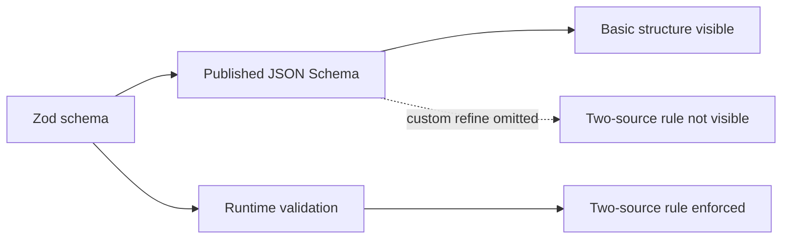
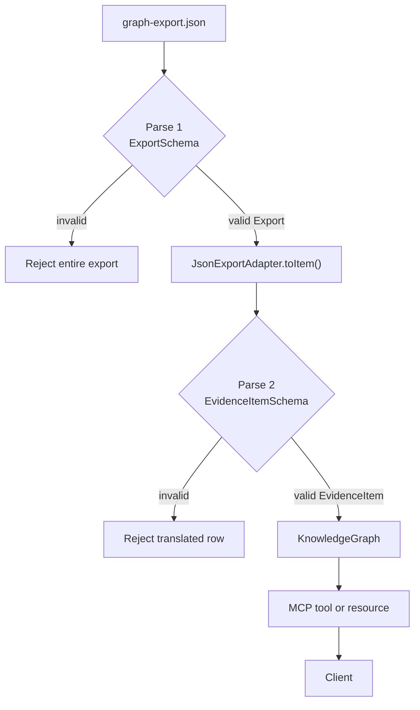

### 1. The three provenance questions

| Provenance question | Field | Example answer |
|---|---|---|
| **What supports this claim?** | `sources` | Code files, ADRs, tests, benchmarks |
| **How and when was this evidence representation generated?** | `generatedBy.activity` and `generatedBy.at` | Generated by `graph-export` at a particular timestamp |
| **What previous record was it derived from?** | `derivedFrom` | A graph snapshot and node identifier such as `snapshot#MOD-001` |

```ts
provenance: {
  sources: [
    { kind: "code", ref: "07-tool-loop/src/gateway.ts" },
    { kind: "adr", ref: "ADR provider-neutral port" }
  ],
  generatedBy: {
    activity: "graph-export",
    at: "2026-09-09T18:00:00Z"
  },
  derivedFrom: [
    "dev-graph-2026-09-09#MOD-001"
  ],
  confidence: "confirmed"
}
```

`confidence` is not one of those three provenance questions. It is an assessment of how strongly the sources support the claim.

---

## 2. Why the two-source rule guards the server but does not reach the client

The rule is a Zod refinement inside `ProvenanceSchema`:

```ts
.refine(
  p => p.confidence !== "confirmed" || p.sources.length >= 2,
  {
    message: "confirmed needs at least two sources",
    path: ["confidence"]
  }
);
```

It means:

```text
confidence === "confirmed"
            ⇒
sources.length >= 2
```

The server executes this TypeScript function when it parses an `EvidenceItem`. Therefore, an item such as this is rejected inside the server:

```json
{
  "sources": [
    { "kind": "code", "ref": "src/gateway.ts" }
  ],
  "confidence": "confirmed"
}
```

### Why the client cannot see the rule

The MCP server publishes an output JSON Schema through `tools/list`. Basic Zod constraints translate into JSON Schema:

- required fields;
- strings and arrays;
- allowed enum values;
- `sources` having at least one element.

But the custom `.refine()` callback is executable TypeScript logic. It is not represented in the generated JSON Schema sent to the client.



Consequently, the server protects its own boundary, but a client cannot discover this rule merely by reading the MCP tool schema.

### What the client must do

A client that depends on the invariant must implement it independently:

```ts
function validateEvidence(item: EvidenceItem): void {
  if (
    item.provenance.confidence === "confirmed" &&
    item.provenance.sources.length < 2
  ) {
    throw new Error(
      "Confirmed evidence must contain at least two sources."
    );
  }
}
```

Alternatively, the contract could publish a hand-written JSON Schema using conditional `if`/`then` logic. In the lesson as written, however, clients must not assume that the published schema communicates every semantic rule.

Also, two sources are only a minimum structural condition. The rule does not prove that the sources are independent, reliable, or mutually consistent.

---

## 3. The two parses between the export file and the client

There are two separate validation boundaries because the producer’s export format and the server’s evidence format are different contracts.



### Parse 1: producer export validation

`loadExport()` reads JSON and passes the raw value to `parseExport()`:

```ts
const parsed = ExportSchema.safeParse(raw);

if (!parsed.success) {
  throw new Error(/* invalid graph export */);
}

return parsed.data;
```

This parse asks:

> Is this a structurally valid graph-export document?

It refuses producer-format problems such as:

- missing or invalid `snapshot`;
- invalid `exported_at`;
- missing `nodes`;
- malformed node rows;
- missing `canonical_id`, `title` or other required fields;
- invalid arrays such as `source_paths`;
- a confidence value outside the allowed vocabulary:

```json
{ "confidence": "probably" }
```

At this point, the data still uses export-specific names:

```ts
canonical_id
source_paths
related_decisions
exported_at
```

This parse does **not** enforce the complete canonical evidence contract. In particular, a row marked `confirmed` with only one source can pass this first parse.

### Translation by the adapter

The adapter converts each validated export row:

```ts
const candidate = toItem(
  row,
  graph.snapshot,
  graph.exported_at
);
```

The translation includes:

```ts
canonical_id      → id
title/status/type → claim
source_paths      → code sources
related_decisions → ADR sources
exported_at       → generatedBy.at
snapshot + id     → derivedFrom
row.confidence    → provenance.confidence
```

### Parse 2: canonical evidence validation

The translated candidate is then parsed as an `EvidenceItem`:

```ts
const parsed = EvidenceItemSchema.safeParse(candidate);

if (!parsed.success) {
  throw new Error(
    `row ${row.canonical_id} rejected`
  );
}
```

This parse asks:

> Did the adapter produce valid evidence according to the server’s canonical evidence contract?

It refuses:

- an empty evidence ID;
- an empty claim;
- no provenance sources;
- invalid source kinds;
- empty source references;
- invalid generation activity;
- an invalid ISO timestamp;
- invalid `derivedFrom` entries;
- invalid confidence labels;
- `confirmed` evidence with fewer than two sources.

For example:

```json
{
  "confidence": "confirmed",
  "sources": [
    { "kind": "code", "ref": "src/gateway.ts" }
  ]
}
```

can pass the export parse but fails the evidence parse because of the cross-field rule.

### Why both are necessary

| Parse | Protects against | Contract being validated |
|---|---|---|
| `ExportSchema.safeParse(raw)` | A malformed or unsupported input file | Producer/export contract |
| `EvidenceItemSchema.safeParse(toItem(...))` | A bad translation or invalid canonical evidence | MCP server’s domain contract |

The first parse does not prove the adapter translated the row correctly. The second parse does not replace the first, because the adapter should not receive arbitrary malformed input.

In short:

> The export is validated before translation; the evidence is validated after translation. Only then may the MCP server expose it to a client.
---

## Evaluation (2026-09-20, appended before lesson 0015)

All three answers are correct at mechanism level.

1. **Three questions → three fields.** Correct, and the note that `confidence` is not one of the three is the distinction the lesson wanted. One wording drift: "what supports this claim" for `sources` is looser than PROV-DM's "who stands behind it" (attribution), but the field mapping is exact.
2. **Why the refinement does not reach the client.** Correct on the mechanism: the refine callback is executable code with no JSON Schema form, so `tools/list` carries the shape and not the rule. The proposed client-side fix (a hand-written check) works; the lesson's answer is to import and run the Zod schema itself, which lesson 0015 now does in `client.ts`. The closing caveat, that two sources are a structural minimum and not proof of independence, is a correct reading of the rule's limits.
3. **The two parses.** Correct and complete: export contract before translation, evidence contract after, and the observation that a `confirmed`-on-one-source row passes the first and fails the second is the exact measured behaviour.

**Promoted to `demonstrated`:** provenance, confidence, derivation. **Held:** evidence-item (the lesson's definition, one claim packaged with its provenance, was not stated in the answers).
