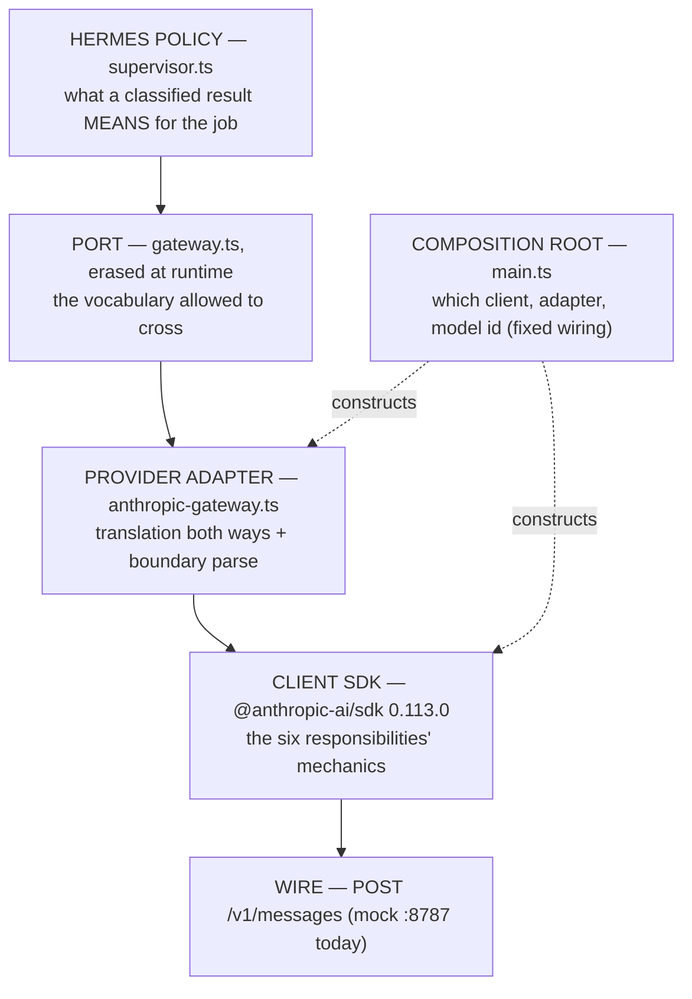

# The control-plane architecture reference

A compact, durable record of the Hermes architecture the course is building, created alongside supplement [0006a — Hermes Architecture Primer](../../lessons/0006a-hermes-architecture-primer.html) so later lessons can link here instead of re-explaining. **This note is a reference mirror, not a source of truth:** the loop and guiding principle live in [MISSION.md](../../MISSION.md), the plan and its firmness gradient in [ROADMAP.md](../../ROADMAP.md), and the Hermes OS integration (two roles, S1–S9 scenario, three graphs) in [[hermes-integration]]. On any conflict, those win — fix this note.

Status labels used throughout, as of **2026-07-29** (after lesson 0006): **implemented** (runs in a shipped lab) · **prepared** (a field or seam exists; the subsystem does not) · **planned** (grounded in MISSION/ROADMAP; Phase 1 lesson ids ≥ 0008 are provisional).

> **Two views, two records (added 2026-07-30).** This note is the *course-side* view: the model boundary as the shipped labs build it, graded implemented/seeded/planned against lab code. The *system-of-record* view — the Claude-Assisted Hermes OS itself: the Hermes job (envelope · Context Pack · lifecycle), the fourteen control-plane components, policy families, capability routing, the gateway map, and the Model Gateway's placement rule, graded **accepted / scaffolded / planned / proposed clarification / open decision** against PDR-001 and ADR-0001..0021 — lives in supplement [0006b](../../lessons/0006b-the-hermes-control-plane.html) and its durable reference `docs/hermes_os/architecture/hermes-job-control-plane.md` (mirror; canonical in the `hermes-os` governance repo). Neither view re-explains the other.

## The loop

```text
validated TaskSpec → bounded planning → Graph RAG evidence
→ approved tool execution → evaluation → durable trace
```

Hermes puts probabilistic reasoning (the model call) inside a deterministic, typed, observable control system (everything else). The three graphs — knowledge (what Hermes knows), workflow (what it may do), trace (what it did) — never merge; their disagreement is how Drift stays detectable ([[hermes-integration#The three graphs are Hermes structures|why]]).

## Hermes policy, operationally

> A **Hermes policy** is a deterministic rule that converts validated facts — about a task, the loop's state, or an external result — into a permitted next action or a terminal outcome.

Its four neighbours, which are *not* policy:

| Concept | What it is | Exercise 05 example |
|---|---|---|
| **the port** | the vocabulary and operations permitted to cross a seam | `gateway.ts`: `ModelCall` · `ModelReply` · `GatewayFailure` · `GatewayResult` |
| **composition / wiring** | constructing concrete clients and adapters at the composition root | `main.ts`: `new Anthropic(...)`, `new AnthropicModelGateway(client, MODEL)` |
| **provider adaptation** | translating between Hermes and provider vocabularies, incl. the boundary parse and failure classification | `anthropic-gateway.ts`: `end_turn → completed`, `RateLimitError → { kind: "throttled" }` |
| **SDK / transport mechanics** | serialization, HTTP, auth, internal retries, timeouts, cancellation plumbing — the six responsibilities | `@anthropic-ai/sdk 0.113.0` honoring `retry-after` |

Beneath them all sits the **wire protocol** — the actual bytes (`POST /v1/messages`), unchanged by every layer above. "Above/below the port" describes **architectural dependency and responsibility** (who may import what, who owns which decision), not security, physical location, or runtime call-stack height.

## The model boundary, layer by layer



Runtime call direction shown; the *import* arrows point at the port from both sides ([[dependency-inversion]]). `ModelGateway` is an erased interface — at runtime only the injected implementation ([[adapter]] or [[fake]]) executes.

## Status ledger (2026-07-29)

| Concern | Status | Owner today | Arrives |
|---|---|---|---|
| SDK invocation, reply validation, failure classification | implemented | `anthropic-gateway.ts` | grows with tools/streaming (0008+, provisional) |
| job outcome decision (`landed` / `retry_later` / `gave_up`) | **minimal — the policy seed** | `supervisor.ts` (`superviseOneCall`, one call only) | expands through Phase 1 |
| model id | fixed configuration | `main.ts` (wiring) | future [[routing-policy]] — reserved, unscheduled |
| provider selection | not implemented | — | future policy only if a requirement/benchmark asks |
| task validation (TaskSpec) | planned | — | lesson 0007 (firm) |
| iteration/token/deadline bounds | planned | — | lesson 0009 (provisional) — S6 |
| tool permission & approval | planned | — | lesson 0010 (provisional) |
| durable trace | prepared (`requestId` kept in the report's notes) | adapter + supervisor | lesson 0011 (provisional) — S7 |
| fully offline loop | partial (fake covers one-call policy) | `FakeModelGateway` | lesson 0012 (provisional) — Phase 1 capstone |

The load-bearing sentence: **lesson 0006 reserves model selection for policy; it does not yet implement model-selection policy.**

## Who decides?

| Question | Owner |
|---|---|
| How is a Hermes call encoded as an Anthropic request? | adapter |
| Which endpoint and API key configure the client? | wiring / configuration |
| How does the SDK retry a 429 internally? | SDK mechanics |
| What does `RateLimitError` mean in Hermes vocabulary? | adapter |
| Should a throttled job wait, retry elsewhere, or terminate? | Hermes policy |
| Which model serves this task? | future routing policy; today fixed wiring |
| May a requested tool run? | future permission policy (0010, provisional) |
| Is the budget exhausted? | future supervisor policy (0009, provisional) |
| What actually happened during the run? | future durable trace (0011, provisional) |

The two "retries" never merge: the SDK re-sends *one HTTP operation* (mechanics, invisible to the supervisor); `retry_later` parks *the job* (policy, recorded in the report).

## Related

[[course-spine]] · [[hermes-integration]] · [[course-module-graph]] · [[lesson-0006-the-model-gateway]] · [[lesson-0006b-the-hermes-control-plane]] · terms: [[port]] · [[adapter]] · [[fake]] · [[model-gateway]] · [[hermes-policy]] · [[composition-root]] · [[routing-policy]] · [[hermes-job]] · [[job-envelope]] · [[context-pack]] · [[job-supervisor]] · [[capability-routing]] · [[capability-gateway]] · [[spec-to-evidence-loop]] · [[drift]] · [[artifact-vault]]
