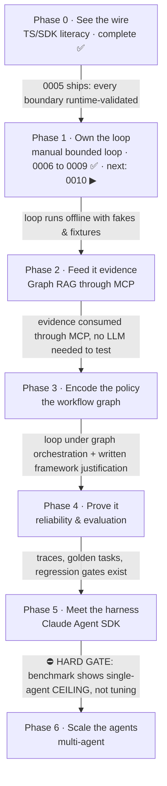
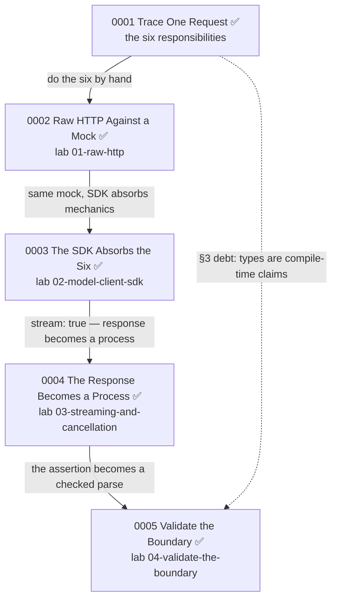
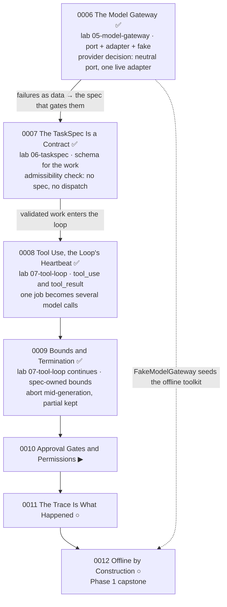
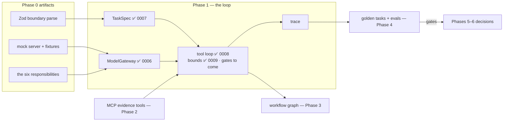

# Module graphs

Graph form of [ROADMAP.md](../../ROADMAP.md): the phases, their gates, and the lesson modules inside the open phase. **Sync duty:** when a lesson ships or a phase opens, update ROADMAP.md *and* this note in the same session. The roadmap's firmness gradient applies here too: shipped = history, next lesson = firm, everything further = provisional.

## The phase graph (gates are edges)

## Phase 0, module detail

Lesson maps: [[lesson-0001-trace-one-request]] · [[lesson-0002-raw-http-against-a-mock]] · [[lesson-0003-the-sdk-absorbs-the-six]] · [[lesson-0004-the-response-becomes-a-process]] · [[lesson-0005-validate-the-boundary]]

## Phase 1, module detail

Lesson maps: [[lesson-0006-the-model-gateway]] · [[lesson-0007-the-taskspec-is-a-contract]] · [[lesson-0008-tool-use-the-loops-heartbeat]] · [[lesson-0009-bounds-and-termination]].

Supplements: 0006a has no map note, so see [[course-architecture]]. [[lesson-0006b-the-hermes-control-plane]] covers the Hermes OS control plane from the governance record. Read 0006 §1 first, then 0006b, then 0006a, then the rest.

## What accumulates (artifacts → the loop)

Each module leaves an artifact that a later module consumes.

Scenario steps these feed (see [[hermes-integration]]):

| Step | Where the course builds it |
|---|---|
| S1 (the envelope check) | Phase 0's boundary parse, then Phase 1's TaskSpec |
| S2 (evidence assembled) | Phase 2, over MCP |
| S3 (dispatch under the graph) | Phase 3 |
| S4 (model calls) | Phase 0's mechanics, below Phase 1's port |
| S5 (the loop iterates) | Phase 1, from lesson 0008 |
| S6 (budget enforcement) | Phase 0's cancellation, enforced by lesson 0009's bounds |
| S7 (the durable record) | Phase 1 and Phase 4 |
| S8 (landing the outputs) | Phase 4 |
| S9 (scoring the run) | Phase 4 |
