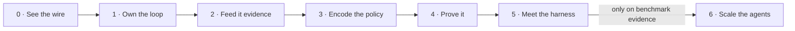

# The thematic spine

> **The spine in one sentence:** every lesson takes one responsibility away from magic and hands it to you as a typed, runtime-validated, testable artifact — and those artifacts accumulate, phase by phase, into the **Hermes Spec-to-Evidence Loop**: the bounded, observable single-agent loop that becomes the control plane of Hermes OS.

The guiding principle from [MISSION.md](../../MISSION.md) — *put probabilistic reasoning inside a deterministic, typed, observable control system* — is not a slogan; it is the course's plot. Phase 0 makes the deterministic shell visible (the wire, the SDK, the boundary). Phases 1–3 build the control system by hand. Phase 4 makes it observable and measurable. Phases 5–6 decide, on evidence, what to delegate to frameworks and to more agents.

## What you can do at the end — and where you will use it

Each terminal skill maps to a live component of Hermes OS (see [[hermes-integration]] for the component definitions and the end-to-end scenario).

| # | Terminal skill | Built in | Used in Hermes OS as |
|---|---|---|---|
| 1 | Trace the complete model/tool loop at wire level — no layer is magic | Phase 0 | Diagnosing any dispatched job that misbehaves: you can tell a transport failure from a policy failure from a model failure |
| 2 | Define contracts that are typed **and** runtime-validated (tasks, state, tools, evidence) | Phases 0–1 | The admissibility rules: "no [[hermes-integration\|envelope]], no dispatch" and "no Context Pack, no dispatch" are Zod parses at a JSON boundary |
| 3 | Implement a bounded single-agent loop: permissions, budgets, approval, termination | Phase 1 | The job supervisor's core — kill-at-ceiling, operator approval gates, the H4/G2/L1–L2 autonomy caps |
| 4 | Expose and consume Graph RAG through MCP, testable without an LLM | Phase 2 | The RAG Factory's evidence supply: `dev_graph` queried as typed, provenance-bearing tools |
| 5 | Encode control flow as a workflow graph with persistence and interruption | Phase 3 | What Hermes *may* do, held as data; harness gates as blocking edges |
| 6 | Test orchestration offline; trace, resume, and diagnose runs | Phases 1 & 4 | The eight harnesses and the Artifact Vault; the "zero silent writes" guarantee is only checkable because every run leaves a trace |
| 7 | Decide framework / Agent SDK / multi-agent questions from benchmark evidence | Phases 5–6 | The OS promotion model (≥10 consecutive clean runs + a signed ADR) applied to your own architecture decisions |

## The arc

- **0 · See the wire** — dissect what an SDK does to an API until nothing downstream is magic; end with contracts validated at runtime, not just claimed at compile time.
- **1 · Own the loop** — build the Spec-to-Evidence Loop by hand: gateway, TaskSpec, tool loop, bounds, approvals, trace. Everything a framework would later hide, you will have already written.
- **2 · Feed it evidence** — the existing Python Graph RAG capability becomes typed MCP tools with provenance; the loop's planning step consumes real evidence.
- **3 · Encode the policy** — control flow leaves the code and becomes an explicit state graph: inspectable, persistable, interruptible.
- **4 · Prove it** — traces, costs, golden tasks, replay. From here on, claims about the system come with measurements.
- **5 · Meet the harness** — the Claude Agent SDK, met the way lesson 0003 met the client SDK: as a layer whose absorbed responsibilities you can already name because you built each one.
- **6 · Scale the agents** — gated, not scheduled: no benchmark showing a single-agent ceiling, no phase.

## The recurring threads

Three threads run the length of the course; lessons anchor new material to them instead of introducing parallel vocabularies:

1. **The six responsibilities** (① endpoint ② auth ③ version ④ contract ⑤ errors/retries ⑥ cancellation/timeout) — introduced in lesson 0001, they reappear every time a new layer absorbs or transforms them, through to the Agent SDK in Phase 5.
2. **The boundary rule** — static types vanish at runtime; every JSON boundary gets a runtime check. Set up as debt in lesson 0001 §3, paid in lesson 0005, enforced everywhere after.
3. **The three graphs** — knowledge (what Hermes knows), workflow (what it may do), trace (what it did). They never merge; keeping them separate is what makes Drift detectable ([[hermes-integration#The three graphs are Hermes structures|why]]).

## How the spine appears in every lesson (normative)

Per the constitution ([CLAUDE.md](../../CLAUDE.md), Article II): every lesson's mission callout states the lesson's **main question**, names the thread(s) above it advances, and names the step of the [[hermes-integration#The integration scenario: one audit job, end to end|integration scenario]] it builds toward. A lesson that cannot name its scenario step is off-spine and should not be authored.
