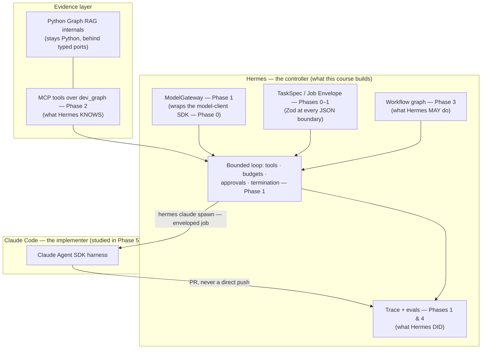

# How the course becomes Hermes OS

This note answers the question the course previously left implicit: **why is a TypeScript/SDK course the path to Hermes OS, and where exactly does each thing you build end up running?**

Primary sources: [docs/hermes_os/README.md](../../docs/hermes_os/README.md) (system overview, guarantees, command interface), [docs/hermes_os/CONTEXT.md](../../docs/hermes_os/CONTEXT.md) (the ubiquitous language — canonical definitions of every capitalized term below), [docs/hermes_os/hermes_tool_catalogue.md](../../docs/hermes_os/hermes_tool_catalogue.md) (the tool landscape). The full design record lives at `C:\Code\Hermes OS`.

## The two roles, and which one the course builds

Hermes OS keeps two roles strictly separate:

- **Hermes** — the persistent controller: scheduler, memory layer, model router, job supervisor, messaging surface. It plans and dispatches typed jobs. *It never implements.*
- **Claude Code** — the repo-local implementation and verification engine. It executes enveloped jobs and produces PRs. *It never orchestrates.*

**The course builds the Hermes side** — the control plane. Every phase adds one subsystem of the controller: the model gateway, the job contract, the bounded loop, the evidence supply, the policy graph, the observability layer. Only in Phase 5 does the course cross to the other role, studying the Claude Agent SDK as *the engine Hermes dispatches to* — and by then every responsibility that SDK absorbs is one you have already built by hand.



## Why TypeScript, specifically

Hermes OS's guarantees are **contract guarantees**: zero silent writes, no envelope → no dispatch, no Context Pack → no dispatch, cost bounded per job, drift surfaced rather than silently resolved. A guarantee like that is only as strong as the boundary that enforces it, and the control plane's boundaries are all JSON boundaries — model output, tool results, job files, MCP payloads, CLI arguments.

TypeScript is the language where the course can hold both halves of that enforcement in one place:

1. **Compile-time claims** — the type system makes every contract explicit and every misuse a build failure (lesson 0003: what moved to compile time).
2. **Runtime validation** — static types vanish at runtime (lesson 0001 §3), so every claim gets a Zod parse at the boundary (lesson 0005 onward). Admissibility checking *is* this parse.
3. **The SDK ecosystem lives here** — the three SDKs that Hermes touches are TypeScript-first: the Anthropic model-client SDK, the MCP TypeScript SDK, and the Claude Agent SDK. So are the Phase 3 candidates (LangGraph.js) and the Phase 4 tooling (OpenTelemetry JS).

Python is not displaced — embeddings, data science, and Graph RAG internals stay Python-side, behind typed ports ([MISSION.md](../../MISSION.md) out-of-scope list). The border between the two languages is itself one of the JSON boundaries the course teaches you to defend.

## Where each SDK becomes part of Hermes

| SDK | Role inside Hermes OS | Course phase |
|---|---|---|
| **Anthropic model-client SDK** (`@anthropic-ai/sdk`) | The model router's transport: every model call Hermes makes — auth, retries honoring `retry-after`, typed errors, streaming, cancellation. Wrapped behind the ModelGateway so mechanics stay below and policy (routing, provider choice, budgets) stays above | 0 (dissected) → 1 (wrapped) |
| **MCP TypeScript SDK** | The evidence surface: `dev_graph` and Graph RAG capabilities exposed as typed tools with provenance, testable without an LLM | 2 |
| **Claude Agent SDK** | The other role: the harness Claude Code runs on when Hermes dispatches `hermes claude spawn`. Studied last, mapped subsystem-by-subsystem against the Phase 1 loop, adopted/wrapped/skipped per the Phase 4 benchmark | 5 |

## Course artifact → Hermes OS component

Canonical definitions for the right-hand column: [docs/hermes_os/CONTEXT.md](../../docs/hermes_os/CONTEXT.md).

| Course artifact | Built in | Hermes OS counterpart |
|---|---|---|
| The six responsibilities, traced raw then through the SDK | 0001–0003 | The transport floor under every dispatched job; the mechanics half of the model router |
| Mid-stream cancellation as a **cost lever** (abort keeps partial text; the rest is never generated, never billed) | 0004 | **Kill-at-ceiling with partial artifact kept** — the cost guarantee's enforcement mechanism, verbatim |
| Zod parse at the JSON boundary | 0005 | **Admissibility checking** — a Context Pack is "a typed, admissibility-checked bundle"; the check is this parse |
| ModelGateway (port with `FakeModelGateway` from day one) | Phase 1 | The **model router**: policy above, mechanics below; provider decisions live here |
| Zod-validated TaskSpec — invalid work rejected before a token is spent | Phase 1 | The **Job Envelope**: "no envelope, no dispatch" |
| Tool loop with approval gates; permissions as data | Phase 1 | Tool policy in the envelope; the human-operator approval guarantee; the H4/G2/L1–L2 autonomy caps |
| Iteration caps, token budgets, deadlines | Phase 1 | Per-job cost ceiling, alert at 80%, weekly hard stop |
| Durable, replayable trace; resume and diagnose | Phases 1 & 4 | The **Artifact Vault** (outputs linked to jobs and costs) and the run-log side of "zero silent writes" |
| Evidence schema with provenance, served over MCP | Phase 2 | **dev_graph** as the semantic authority; the RAG Factory's audit/refresh operations |
| Workflow graph with persistence and interruption | Phase 3 | What Hermes *may* do, encoded as data; **Harness** gates as blocking edges |
| Golden tasks, replayable fixtures, regression gates | Phase 4 | The eight harnesses; the factory's benchmark duty (`hermes rag audit --graph-health --cost-report`) |
| Adopt/wrap/skip decision per Agent SDK subsystem | Phase 5 | The boundary between Hermes-native supervision and the Claude Code harness |
| Multi-agent only on benchmark evidence | Phase 6 | The **promotion model**: ≥10 consecutive clean runs + a signed ADR; v1 explicitly forbids multi-agent orchestration |

## The integration scenario: one audit job, end to end

The scenario every lesson anchors to. An operator runs:

```
hermes rag audit atlas --graph-health --cost-report --no-writeback
```

Steps are numbered **S1–S9**; lesson mission callouts reference them (constitution, Article II).

- **S1 · Envelope.** The Job Envelope (title, owner, model policy, tool policy, cost ceiling, output path, completion + cancellation rules) is parsed and Zod-validated. Invalid → rejected before a single token is spent. *Built by: lesson 0005, Phase 1 TaskSpec.*
- **S2 · Context Pack.** Evidence is assembled by querying `dev_graph` through MCP tools; every item carries provenance; the assembled pack is admissibility-checked at the boundary. No pack → no dispatch. *Built by: Phase 2.*
- **S3 · Dispatch under the workflow graph.** The audit's permitted states and transitions are data, not vibes; approval gates sit on the edges. *Built by: Phase 3.*
- **S4 · Model calls through the ModelGateway.** Below the port: the client SDK's mechanics — auth headers, retries honoring `retry-after`, typed errors the supervisor can classify. Above it: Hermes policy — routing, provider, model choice. *Built by: lessons 0002–0003, Phase 1.*
- **S5 · The loop iterates.** `tool_use` → gate check → `tool_result`. Read-only graph queries pass automatically; writeback tools are blocked here by `--no-writeback` (and would otherwise queue for the operator — H4). *Built by: Phase 1 tool-loop lessons.*
- **S6 · Budget enforcement.** Usage streams in per `message_delta`; at 80% of the ceiling Hermes alerts; at the ceiling the `AbortController` fires **mid-generation** — the remainder is never generated, never billed, and the partial output is kept as a partial artifact. *Built by: lesson 0004, Phase 1 bounds.*
- **S7 · Trace.** Every event appends to a durable, replayable trace; an interrupted run can resume from it. *Built by: Phase 1 trace lesson, Phase 4.*
- **S8 · Landing.** Outputs persist to the Artifact Vault, linked to the job and its cost. Anything that would mutate a repo goes out as a PR — never a direct push. A conflict between graph intent and observed reality is recorded as an **Open Decision** artifact and blocks that path; neither side silently wins (that disagreement is **Drift**). *Built by: Phases 1 & 4.*
- **S9 · Evaluation.** The run is scored against golden tasks; regressions gate any promotion (of blueprints, of autonomy levels, of architecture changes). *Built by: Phase 4.*

```mermaid
sequenceDiagram
    participant OP as Operator
    participant H as Hermes (control plane)
    participant G as dev_graph via MCP
    participant M as Model (via ModelGateway)
    participant V as Artifact Vault
    OP->>H: hermes rag audit atlas --no-writeback
    H->>H: S1 Zod-parse Job Envelope — invalid? reject, zero tokens
    H->>G: S2 typed evidence queries (provenance attached)
    G-->>H: Context Pack — admissibility-checked
    H->>H: S3 enter workflow graph (gates on edges)
    loop S4–S5 bounded loop
        H->>M: messages.create via gateway (retries, typed errors)
        M-->>H: stream: deltas + usage
        H->>H: tool_use → gate check → tool_result
    end
    Note over H,M: S6 at cost ceiling: abort mid-generation —<br/>partial output kept as partial artifact
    H->>V: S7–S8 trace + outputs, linked to job & cost (PR, never push)
    H->>H: S9 score vs golden tasks; Drift → Open Decision
```

## The three graphs are Hermes structures

The course's standing rule — knowledge, workflow, and trace graphs never merge — is not a stylistic preference. It is what makes Hermes OS's central defect class, **Drift**, detectable:

| Course graph | Hermes OS structure | Question it answers |
|---|---|---|
| Knowledge | `dev_graph` (canonical; CodeGraph is derived, never canonical) | What does Hermes know — what is admissible? |
| Workflow | Envelopes, tool policy, harness gates | What may Hermes do? |
| Trace | Artifact Vault, run logs, cost ledger | What did Hermes actually do? |

Drift is the *disagreement* between the first and the third (intent vs. reality). Merge the graphs and one side silently wins — exactly the failure the OS's "blocking defect, never silently resolved" rule exists to prevent. A course that let graph fluency blur these together would be training the bug in.

## Normative use in lessons

Per the constitution ([CLAUDE.md](../../CLAUDE.md), Article II): every lesson's mission callout names the scenario step(s) **S1–S9** the lesson builds toward, in one sentence a learner can verify against this note. Term notes' "Hermes relevance" sections should point at the same steps. If a planned lesson maps to no step, it is either generic TypeScript teaching (out of scope by [MISSION.md](../../MISSION.md)) or the scenario is missing a step — resolve which before authoring.
