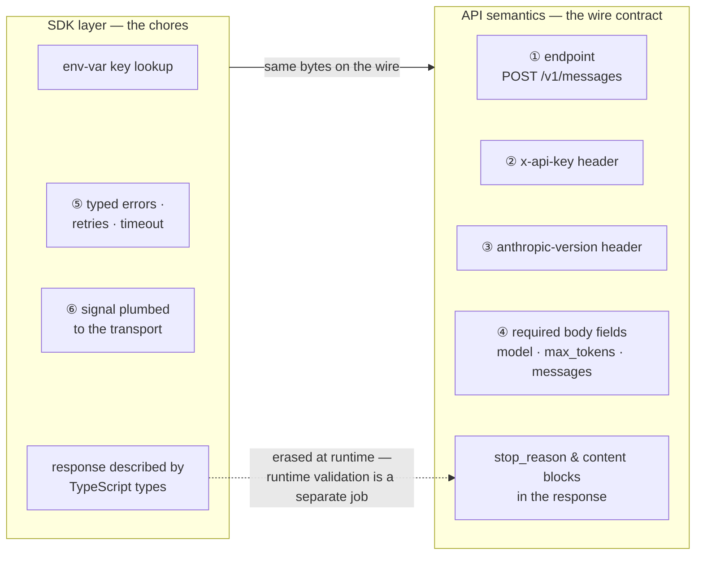
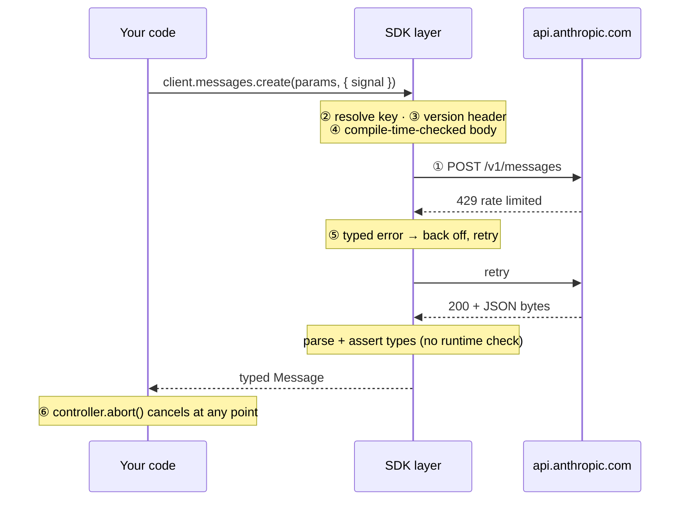

# Lesson 0001 — Trace One Request Through an API and a TypeScript SDK

One HTTP request written twice — raw `fetch` and `@anthropic-ai/sdk` — to separate what belongs to the wire contract from what the library does for you. Material: [open the lesson](../../lessons/0001-trace-one-request-api-vs-sdk.html).

## The two layers



## The six responsibilities on one request



## Terms introduced

[[api]] · [[sdk]] · [[endpoint]] · [[api-key-authentication]] · [[api-version-header]] · [[request-contract]] · [[messages-api]] · [[stop-reason]] · [[error-boundary]] · [[retry-with-backoff]] · [[cancellation]] · [[type-erasure]] · [[type-assertion]] · [[narrowing]] · [[discriminated-union]] · [[runtime-validation]] · [[model-gateway]]

```dataview
TABLE term AS Term, category AS Category, status AS Status
FROM "wiki/terms"
WHERE type = "glossary-term" AND lesson = "0001"
SORT category ASC, term ASC
```
