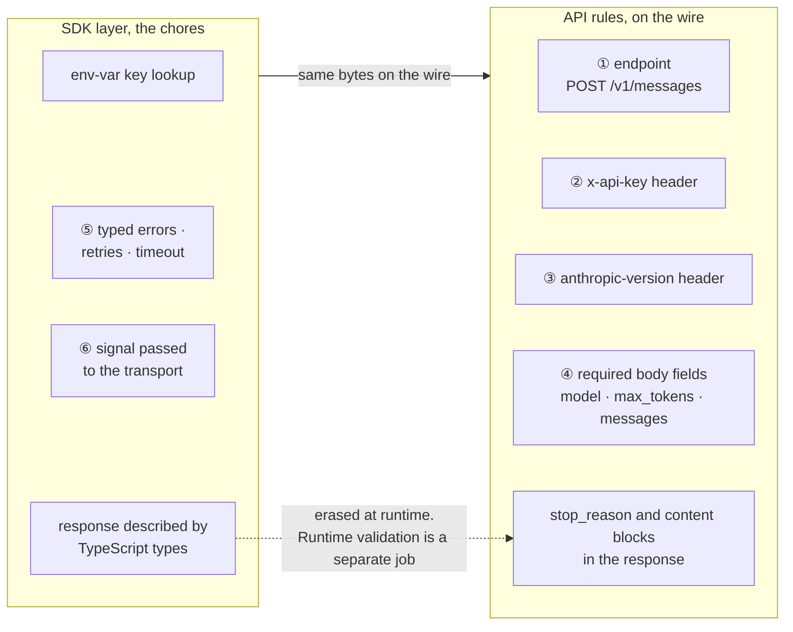
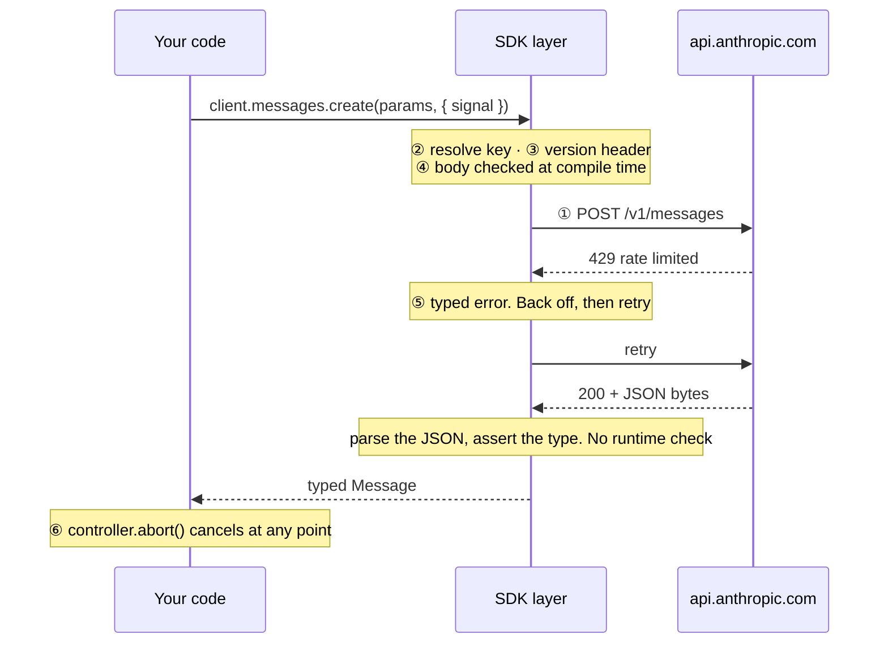

# Lesson 0001 — Trace One Request Through an API and a TypeScript SDK

One HTTP request written twice, raw `fetch` and `@anthropic-ai/sdk`. The lesson separates the API's rules from the library's chores. Material: [open the lesson](../../lessons/0001-trace-one-request-api-vs-sdk.html).

## The two layers



## The six responsibilities on one request



## Terms

Registered to this lesson: [[api]] · [[sdk]] · [[request-and-response-shape]] · [[type-assertion]] · [[type-erasure]] · [[runtime-validation]]

## What the 2026-08-16 rewrite changed

- The lesson went from 21 lint errors to 0 under `docs/style/ste-profile.md`.
- *Contract* left the lesson, and responsibility ④ is now the request and response shape.
- The note `request-contract.md` was renamed to `request-and-response-shape.md`, per the 2026-08-08 ruling.
- A fourth quiz question was added, per the Article V calibration.
- Eleven of the original seventeen term notes moved to the lessons that exercise them.

| New home | Notes moved |
|---|---|
| lesson 0002 | [[endpoint]] · [[api-key-authentication]] · [[messages-api]] · [[stop-reason]] |
| lesson 0003 | [[api-version-header]] · [[error-boundary]] · [[retry-with-backoff]] · [[cancellation]] · [[narrowing]] |
| lesson 0005 | [[discriminated-union]] |
| lesson 0006 | [[model-gateway]] |

```dataview
TABLE term AS Term, category AS Category, status AS Status
FROM "wiki/terms"
WHERE type = "glossary-term" AND lesson = "0001"
SORT category ASC, term ASC
```
