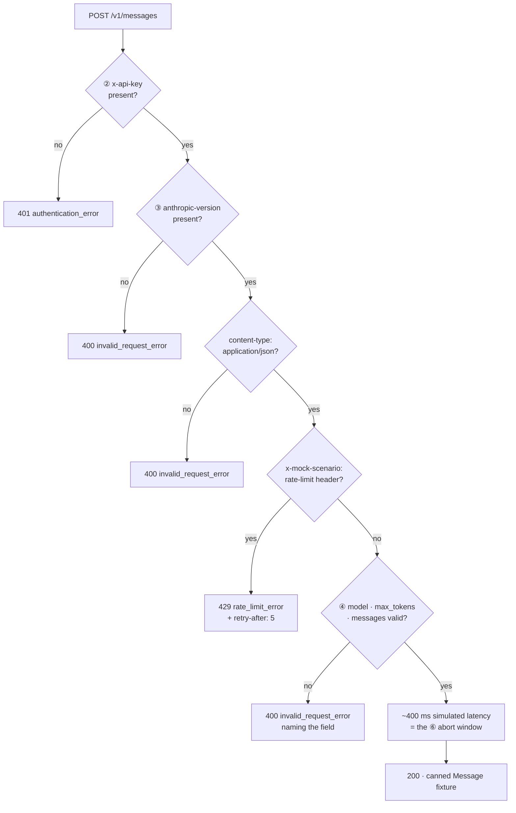
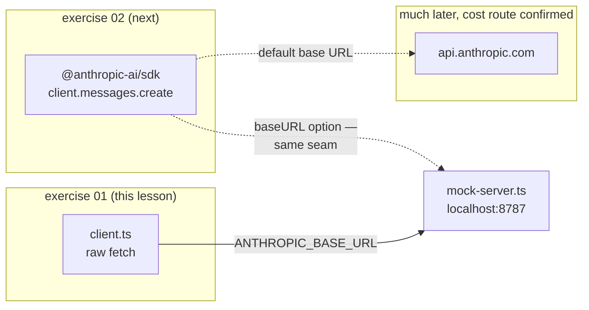

# Lesson 0002 — Run the Raw Request, Against a Mock

Lesson 0001's raw `fetch` call, actually sent — against a local [[test-double]] of the Messages API, then deliberately broken five ways so each of the six responsibilities fails observably. Material: [open the lesson](../../lessons/0002-raw-http-against-a-mock.html) · lab: `hermes-sdk-lab/01-raw-http/`.

## The mock's validation gates



## The base-URL seam, across exercises



The seam generalizes: swap a real dependency for a [[test-double]] at a boundary you control. Phase 1's `FakeModelGateway` is this diagram one level up, with the [[model-gateway]] interface as the boundary.

## Terms introduced

[[test-double]] · [[base-url]] · [[lockfile]] · [[es-modules]] · [[strict-mode]]

```dataview
TABLE term AS Term, category AS Category, status AS Status
FROM "wiki/terms"
WHERE type = "glossary-term" AND lesson = "0002"
SORT category ASC, term ASC
```
