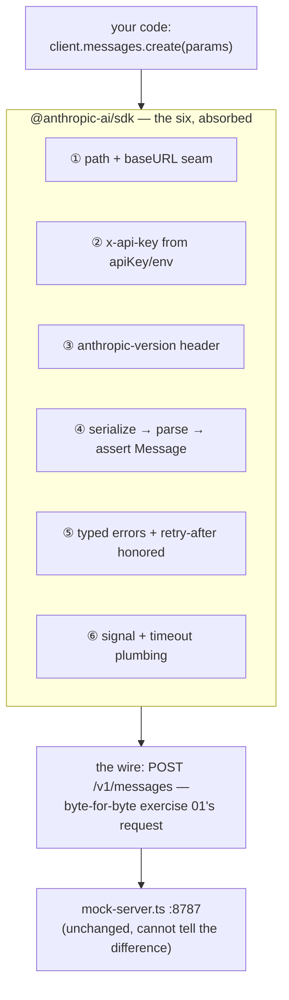
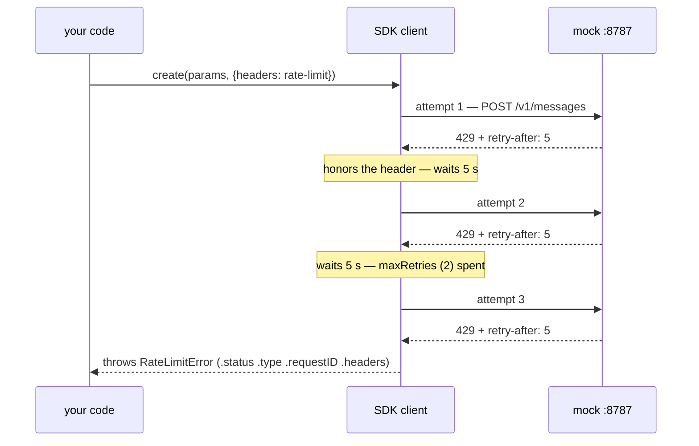

# Lesson 0003 — The SDK Absorbs the Six

Exercise 01's raw request rewritten with the official `@anthropic-ai/sdk`, aimed at the same [[test-double]] through the [[base-url]] seam. Each of the six responsibilities becomes a constructor option, a typed parameter, or automatic behavior — and the mock cannot tell the two clients apart, which is the definition of an [[sdk]] made observable. Material: [open the lesson](../../lessons/0003-the-sdk-absorbs-the-six.html) · lab: `hermes-sdk-lab/02-model-client-sdk/`.

## The six, absorbed into a layer



## Responsibility ⑤, made visible



Measured against the mock: 3 requests in the server log, ~10.1 s of client-side silence, one typed error. The raw client of exercise 01 could only *print* `retry-after`; the [[api-client]] obeys it — [[retry-with-backoff]], implemented for you.

## What moved left, what stayed put

- Misspelled `mesages` and missing `max_tokens`: runtime 400s in exercise 01, **compile errors** now — the [[request-contract]] enforced by `MessageCreateParams`.
- Misspelled model id: still compiles — `Model` ends in `(string & {})` so new models don't break old SDKs; the catalog is server-side truth.
- The response: the SDK's `Message` type is still a [[type-assertion]] over parsed bytes ([[type-erasure]] applies to declaration files too). Runtime validation stays Hermes's job — Zod at Phase 1's JSON boundaries.

## Terms introduced

[[api-client]] · [[request-options]] · [[typed-error]] · [[declaration-file]]

```dataview
TABLE term AS Term, category AS Category, status AS Status
FROM "wiki/terms"
WHERE type = "glossary-term" AND lesson = "0003"
SORT category ASC, term ASC
```
