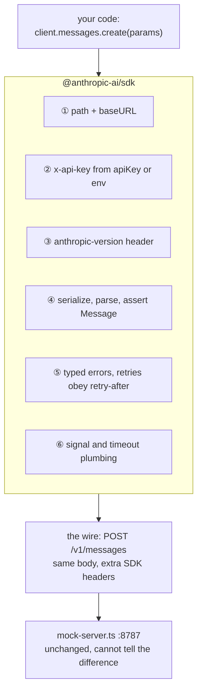
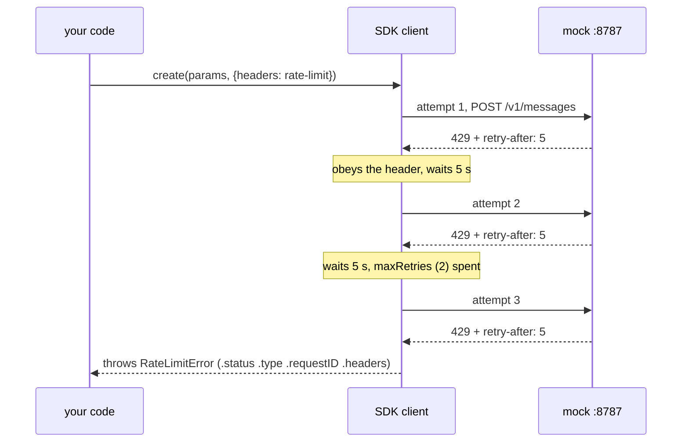

# Lesson 0003 — The SDK Absorbs the Six Responsibilities

Exercise 01's raw request, rewritten with the official `@anthropic-ai/sdk` and aimed at the same
[[test-double]] through the [[base-url]] option. Each of the six responsibilities becomes a
constructor option, a typed parameter, or automatic behavior. The mock cannot tell the two clients
apart, which is the definition of an [[sdk]] made observable.
Material: [open the lesson](../../lessons/0003-the-sdk-absorbs-the-six.html) · lab:
`hermes-sdk-lab/02-model-client-sdk/`.

## The six responsibilities, absorbed into a layer



Measured 2026-08-18 with a captured request: the SDK's body is byte-for-byte the raw client's 102
bytes, and the headers are a superset. The extras are the SDK's own name and telemetry, and the mock
ignores them.

## Responsibility ⑤, made visible



Measured against the mock: three requests in the server log, 10.1 seconds of client silence, one
typed error. The raw client of exercise 01 could only print `retry-after`. The [[api-client]] obeys
it, which is [[retry-with-backoff]] implemented for you.

## What moved left, what stayed put

- A misspelled `mesages` and a missing `max_tokens` were runtime 400s in exercise 01. They are
  compile errors now, enforced by `MessageCreateParams`, the
  [[request-and-response-shape|request shape]] as a type.
- A misspelled model id still compiles, because `Model` ends in `(string & {})`. The catalog stays on
  the server.
- The response is still a [[type-assertion]] over parsed bytes, because [[type-erasure]] applies to
  declaration files too. Runtime validation is Hermes's job, paid in lesson 0005.

## Terms introduced

[[api-client]] · [[request-options]] · [[typed-error]] · [[declaration-file]] ·
[[retry-with-backoff]] · [[cancellation]]

```dataview
TABLE term AS Term, category AS Category, status AS Status
FROM "wiki/terms"
WHERE type = "glossary-term" AND lesson = "0003"
SORT category ASC, term ASC
```

## What the 2026-08-18 rewrite changed

- The lesson was rewritten to `docs/style/ste-profile.md`. Scope was kept, and the title gained the
  word "Responsibilities".
- Three notes left this lesson's registry by user decision: [[api-version-header]],
  [[error-boundary]] and [[narrowing]] are ordinary vocabulary now. Two arrivals from lesson 0001,
  [[retry-with-backoff]] and [[cancellation]], stayed and are defined in the lesson.
- The lesson gained a captured wire request, a signature table, a status table, and a version pin.
- One claim was corrected by measurement: the SDK's request body is byte-for-byte the raw client's,
  and its headers are not.
