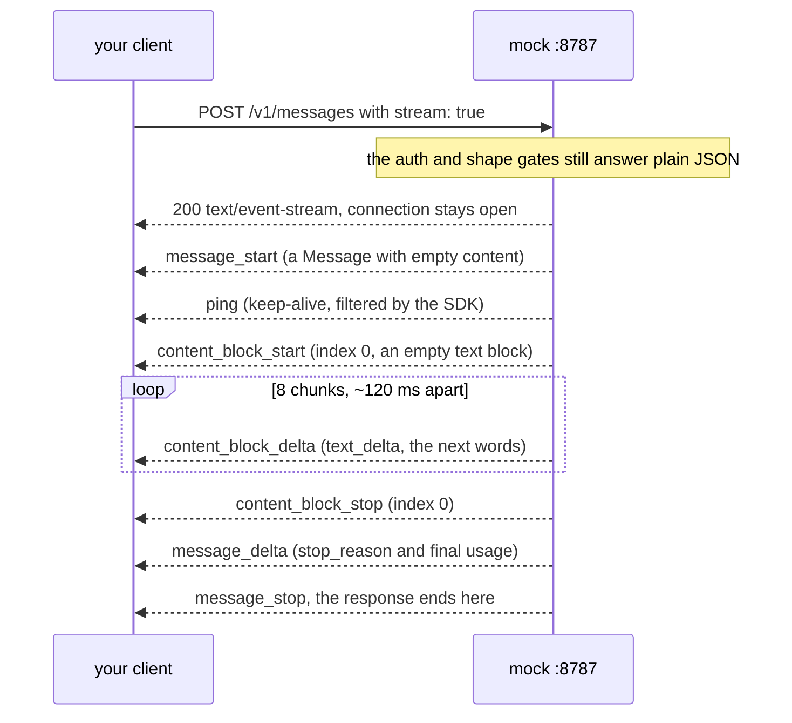
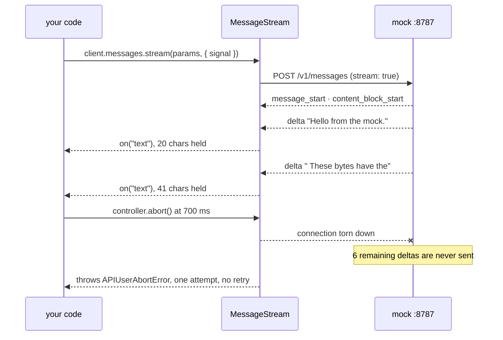

# Lesson 0004 — The Response Becomes a Process

Exercise 02's request gains one field, `stream: true`. The response becomes a process. Typed events arrive as [[server-sent-events]], an [[async-iterator]] consumes them, and the [[message-stream]] helper reassembles exercise 02's `Message`. [[cancellation]] gains a target mid-response. Material: [open the lesson](../../lessons/0004-the-response-becomes-a-process.html) · lab: `hermes-sdk-lab/03-streaming-and-cancellation/`.

## The streaming events, as the mock sends them



Measured: 13 events reach the client over ~1.4 s. The SDK filters the wire's `ping` out before iteration. Assemble every [[delta]] onto `message_start`'s value and the result is byte-for-byte the non-streaming `Message`. Streaming changes delivery. The response shape does not change.

## Responsibility ⑥ (cancellation), transformed



Measured: the abort at 700 ms raises `APIUserAbortError` about 30 ms later. The client keeps 41 of 164 characters. The mock logs two of eight deltas, then the disconnect. The remainder is never generated, and against the real API never billed. That is what scenario step S6 (budget enforcement) uses to stop spend.

## What arrives when

- The counts `usage.input_tokens`, plus `id` and `model`, ride `message_start`: known before generating.
- The text arrives as [[delta]] patches, while generating.
- The [[stop-reason]] and the real `usage.output_tokens` ride `message_delta`, at the end.
- Mid-flight, a call's cost and ending are unknown.
- The value of `finalMessage()._request_id` is `undefined`. The id lives on `stream.request_id`.

## What the 2026-08-16 rewrite changed

The lesson went from 1,881 words and 21 errors to 1,993 words and 0, under `docs/style/ste-profile.md`. The em-dash asides, the bold-led bullets and the reader guidance were deleted. They paid for four `<dfn>` definitions, a new-vs-reprise callout, a status table, the bounded compression and a version pin. A layer table now keys the circled numbers. The word *contract* no longer names the response shape, per the 2026-08-08 rename.

## Terms introduced

[[server-sent-events]] · [[delta]] · [[async-iterator]] · [[message-stream]]

```dataview
TABLE term AS Term, category AS Category, status AS Status
FROM "wiki/terms"
WHERE type = "glossary-term" AND lesson = "0004"
SORT category ASC, term ASC
```
