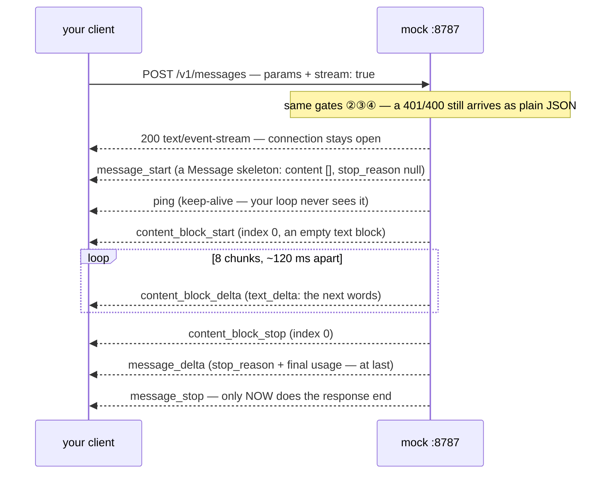
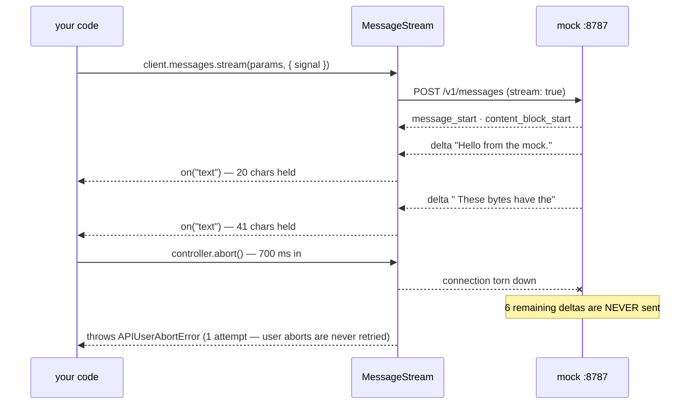

# Lesson 0004 — The Response Becomes a Process

Exercise 02's request with one field added — `stream: true` — against the same [[test-double]]: the response stops being a value and becomes a process. [[server-sent-events]] carry a typed event grammar, an [[async-iterator]] consumes it, the [[message-stream]] helper folds it back into the very `Message` exercise 02 received in one piece, and [[cancellation]] gains a target *mid-response*. Material: [open the lesson](../../lessons/0004-the-response-becomes-a-process.html) · lab: `hermes-sdk-lab/03-streaming-and-cancellation/`.

## The event grammar, as the mock plays it



Measured: 13 events reach the client over ~1.4 s; the wire's `ping` is filtered out by the SDK before iteration. The [[delta]] fold — skeleton + patches + retrofit — reassembles byte-for-byte the non-streaming `Message`: **streaming changes delivery, not the contract.**

## Responsibility ⑥, transformed



Measured: abort at 700 ms → `APIUserAbortError` ~30 ms later; the client keeps 41 of 164 characters; the mock logs 2 of 8 deltas then *client aborted the request mid-flight*. The remainder is never generated — against the real API, never billed. [[cancellation]] graduated from a hang-up lever to a **cost** lever, which is what makes Hermes's budgets enforceable.

## Order of knowledge

- `usage.input_tokens`, `id`, `model` — in the **skeleton**: known before generating.
- The text — as [[delta]] patches, while generating.
- [[stop-reason]] and the real `usage.output_tokens` — in `message_delta`, at the **end**: mid-flight, cost and ending are unknown.
- `finalMessage()._request_id` is `undefined` — the assembled object never traveled as one HTTP body; the id lives on `stream.request_id`. Layers own facts.

## Terms introduced

[[server-sent-events]] · [[delta]] · [[async-iterator]] · [[message-stream]]

```dataview
TABLE term AS Term, category AS Category, status AS Status
FROM "wiki/terms"
WHERE type = "glossary-term" AND lesson = "0004"
SORT category ASC, term ASC
```
