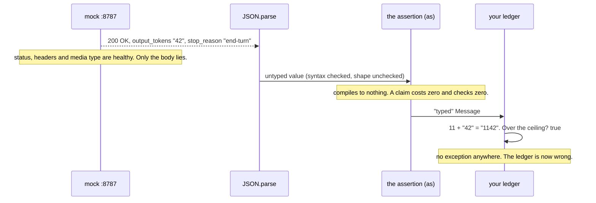
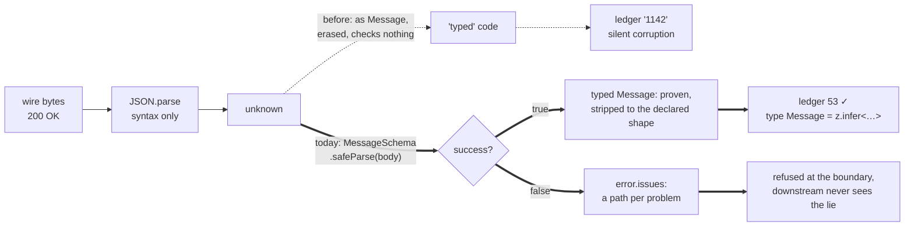

# Lesson 0005 — Validate the Boundary

The debt opened in lesson 0001 comes due. Response types are compile-time claims about runtime bytes, and the mock's `x-mock-scenario: drift` header makes one of those claims false. Exercise 01's [[type-assertion|assertion]] waves the lie through into a corrupt ledger. A [[zod-schema]] at the [[json-boundary]] catches it, with a path per problem. [[schema-inference]] then derives the type from the schema. Phase 0 closes here. Material: [open the lesson](../../lessons/0005-validate-the-boundary.html) · lab: `hermes-sdk-lab/04-validate-the-boundary/`.

## The lie travels (Part A, measured)



Measured against the mock, with zod 4.4.3: the run spent 53 tokens and the ledger claims `"1142"`. The 1000-token ceiling check fires a breach that never happened. No layer built in exercises 01 to 03 objects. HTTP vouches for the exchange, the compiler ran before the bytes existed, and both the hand-written interface and the SDK's `Message` are [[type-erasure|erased]] claims.

## The boundary, before and after



- One [[safe-parse]] reported both drifts at once: `invalid_value` at `stop_reason`, and `invalid_type` at `usage.output_tokens`.
- The schema's `z.enum` holds rules the old `string` type could not state.
- The parse returns the declared subset: 9 wire keys became 7, and `usage` went from 4 to 2. `z.strictObject` refuses unknown keys instead of stripping them.
- The boundary check is the one responsibility the [[sdk]] never absorbs. It stays with the application in every phase.

## Hermes anchoring

Step S1 (the envelope is parsed) rejects invalid work before a token is spent, with the reasons as data. Step S2 (evidence is checked) runs the same parse over a Context Pack. The lesson pays the boundary rule opened as debt in lesson 0001, and every later lesson enforces it. The term [[runtime-validation]] has sat at `introduced` since lesson 0001, and is now eligible for promotion.

## Terms introduced

[[json-boundary]] · [[zod-schema]] · [[safe-parse]] · [[schema-inference]]

```dataview
TABLE term AS Term, category AS Category, status AS Status
FROM "wiki/terms"
WHERE type = "glossary-term" AND lesson = "0005"
SORT category ASC, term ASC
```
