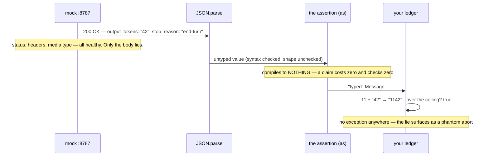
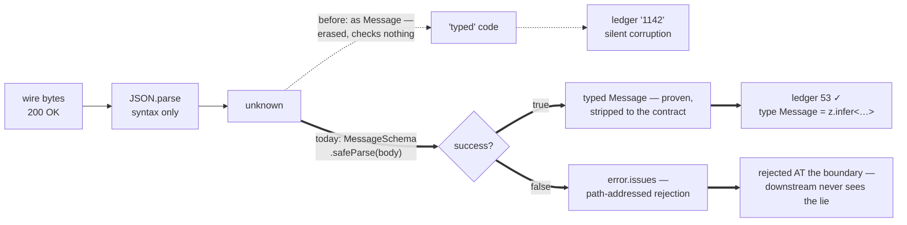

# Lesson 0005 — Validate the Boundary

The debt open since lesson 0001 §3 — response types are compile-time claims about runtime bytes — comes due and gets paid. The mock's `x-mock-scenario: drift` header makes the wire quietly break its word; exercise 01's [[type-assertion|assertion]] pipeline waves the lie through into a corrupt budget ledger, and a [[zod-schema]] at the [[json-boundary]] catches it with path-addressed reasons. [[schema-inference]] then inverts the arrow: the type is derived from the schema, one source of truth. **Phase 0 closes here.** Material: [open the lesson](../../lessons/0005-validate-the-boundary.html) · lab: `hermes-sdk-lab/04-validate-the-boundary/`.

## The lie travels (Part A, measured)



Measured against the mock (zod 4.4.3): actual spend 53 tokens; the ledger claims `"1142"` (string concatenation) and the 1000-token ceiling check fires a phantom breach. No layer built in exercises 01–03 objects: HTTP vouches for the envelope, the compiler ran before the bytes existed, and both the hand-written interface and the SDK's `Message` (0.113.0) are [[type-erasure|erased]] claims.

## The boundary, before and after



- One [[safe-parse]] reported **both** drifts at once: `invalid_value` at `stop_reason` (the schema's `z.enum` out-checked the old `string` type), `invalid_type` at `usage.output_tokens`.
- The parse returns the **declared subset**: 9 wire keys → 7; `usage` 4 → 2 (Zod's default strip policy; `strictObject` would reject instead).
- The check is the one responsibility the [[sdk]] does **not** absorb — it stays with the application, in every phase.

## Hermes anchoring

Scenario steps **S1** (the Job Envelope is Zod-parsed — invalid work rejected before a token is spent, with reasons as data) and **S2** (the Context Pack's admissibility check *is* this parse, aimed at evidence). The spine's boundary-rule thread — set up as debt in lesson 0001, paid here, enforced everywhere after. [[runtime-validation]], waiting at `introduced` since lesson 0001, has now been used in anger and is eligible for promotion on demonstrated use.

## Terms introduced

[[json-boundary]] · [[zod-schema]] · [[safe-parse]] · [[schema-inference]]

```dataview
TABLE term AS Term, category AS Category, status AS Status
FROM "wiki/terms"
WHERE type = "glossary-term" AND lesson = "0005"
SORT category ASC, term ASC
```
