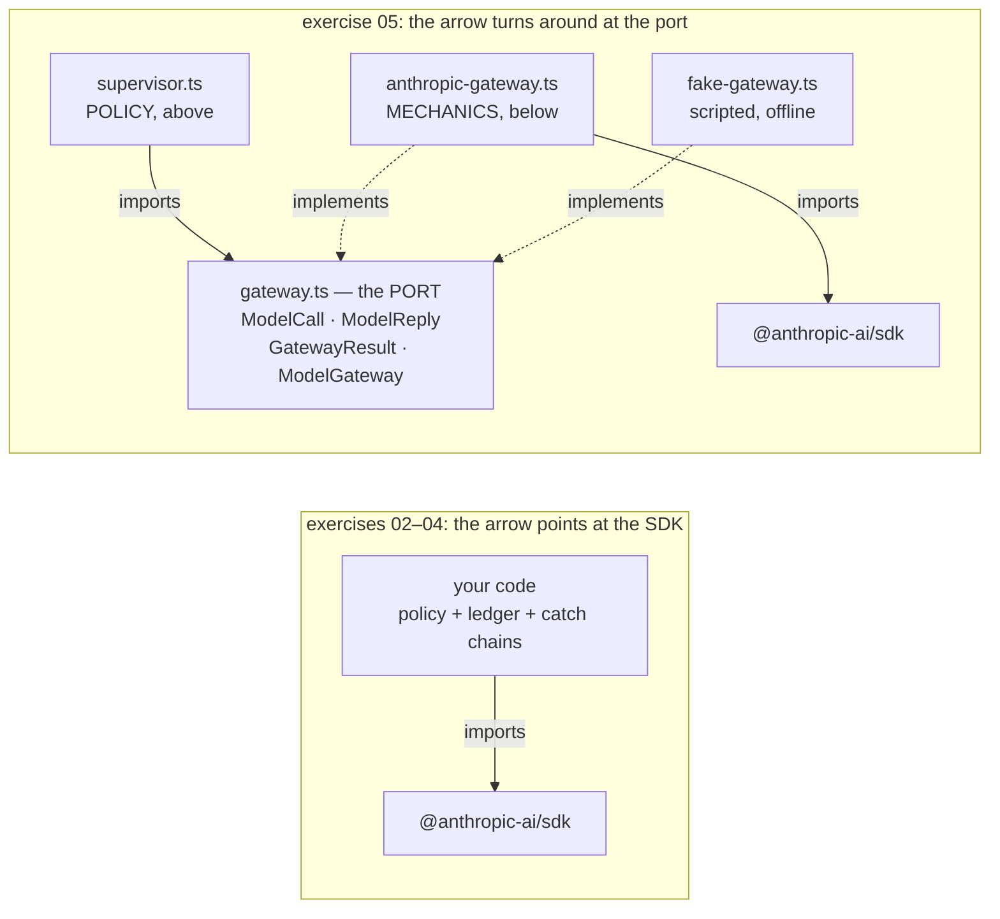
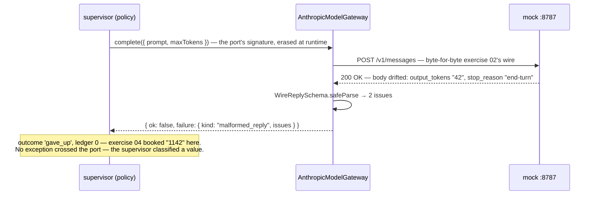

# Lesson 0006 — The Model Gateway

Phase 1 opens by drawing the line S4 requires: **mechanics below, policy above**. The [[sdk]] goes behind a [[port]] owned by Hermes (`gateway.ts` — `ModelCall`, `ModelReply`, `GatewayResult`, `ModelGateway`); the [[adapter]] (`AnthropicModelGateway`) translates calls down, replies up through the permanent [[safe-parse|boundary parse]], and [[typed-error]] exceptions into failure *data*; the [[fake]] (`FakeModelGateway`) makes the same supervisor run offline in 0.6 ms. The provider-neutrality decision, open since session 1, lands: **neutral port, one live adapter** — neutrality is a property of the seam, not a count of adapters. Material: [open the lesson](../../lessons/0006-the-model-gateway.html) · lab: `hermes-sdk-lab/05-model-gateway/`.

> **Supplement 0006a (2026-07-29):** [Hermes Architecture Primer — Where the Model Gateway Fits](../../lessons/0006a-hermes-architecture-primer.html) supplies the architecture context this lesson assumed: the Spec-to-Evidence Loop drawn end to end, an operational definition of [[hermes-policy]] (vs. [[composition-root|wiring]], adaptation, validation, mechanics), and an implemented/seeded/planned ledger for exercise 05 — today's supervisor is a one-call policy *seed*; routing ([[routing-policy]]), budgets, permissions, and the trace do not exist yet. Read after §1 or right after the lesson. Durable reference: [[course-architecture]].

> **Supplement 0006b (2026-07-30):** [The Hermes Control Plane — From Job to Evidence](../../lessons/0006b-the-hermes-control-plane.html) answers the question prior to both: what the Claude-Assisted Hermes OS *is*, from the governance record — the [[hermes-job|Hermes job]] as the unit of work ([[job-envelope]] · [[context-pack]] · lifecycle), the [[job-supervisor]], [[capability-routing]] before model routing, the [[capability-gateway|gateway map]], and the placement rule: the [[model-gateway]] enters only at the first step that genuinely needs probabilistic reasoning. Reading order: 0006 §1 → 0006b → 0006a → the rest. Map note: [[lesson-0006b-the-hermes-control-plane]].

## The arrow turns around (measured in import statements)



The check is one command: `grep -r "@anthropic-ai/sdk" src/` hits exactly the adapter and `main.ts` (wiring) — never a domain file. That grep *is* [[dependency-inversion]], verifiable in a terminal.

## One drifted reply, two lessons apart



- Measured (SDK 0.113.0, zod 4.4.3): clean call → `{ outcome: 'landed', tokensSpent: 53 }` with the wire's `end_turn` translated to Hermes's `completed`; 429 with `maxRetries: 0` → `{ kind: 'throttled', retryAfterMs: 5000 }` (wire seconds → port milliseconds); abort at 100 ms → `{ kind: 'aborted' }`; drift → refused with both issues, **zero** tokens booked.
- The wire is untouched: the port is compile-time architecture; the network cannot see it.
- With the mock **stopped**, the fake ran the same supervisor — including the retry-later policy branch — in 0.6 ms.

## Hermes anchoring

Scenario step **S4** verbatim (model calls through the ModelGateway; typed failures the supervisor classifies), seeding **S6** (the supervisor's `AbortSignal` crosses the port) and **S7** (`requestId` kept for the trace). Decision recorded in NOTES.md 2026-07-29: provider-neutral port, exactly one live adapter, the [[fake]] as the second implementation that keeps the contract honest.

## Terms introduced

[[port]] · [[adapter]] · [[fake]] · [[dependency-inversion]]

```dataview
TABLE term AS Term, category AS Category, status AS Status
FROM "wiki/terms"
WHERE type = "glossary-term" AND lesson = "0006"
SORT category ASC, term ASC
```
