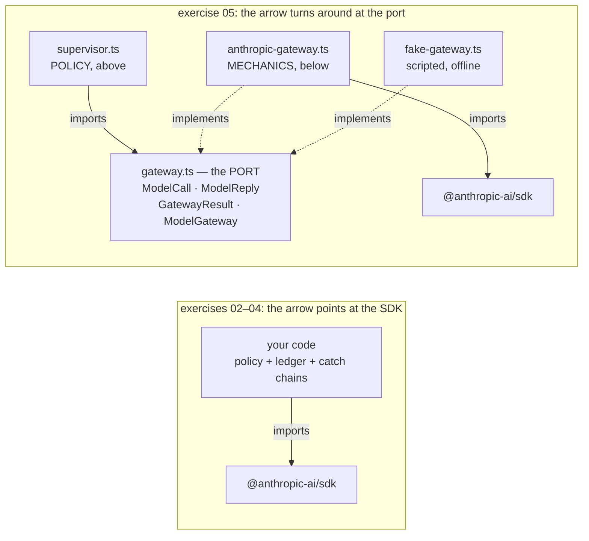
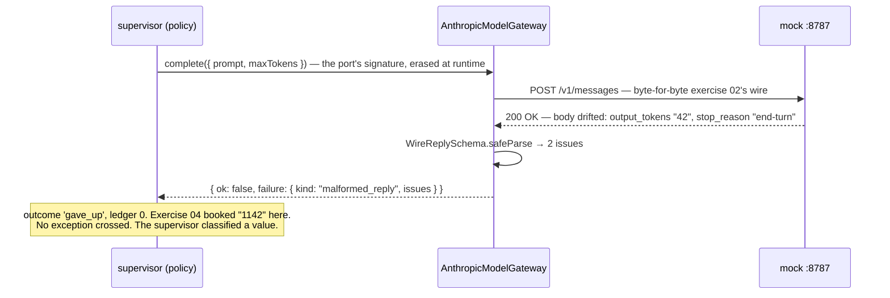

# Lesson 0006 — The Model Gateway

Phase 1 opens by drawing the line S4 requires: mechanics below, policy above. The [[sdk]] goes behind a [[port]] that Hermes owns, `gateway.ts`. The [[adapter]] `AnthropicModelGateway` translates calls down, replies up through the [[safe-parse|boundary parse]], and [[typed-error]] exceptions into failure data. The [[fake]] `FakeModelGateway` runs the same supervisor offline in 0.6 ms.

The provider question, open since session 1, landed here. Hermes gets a provider-neutral port with exactly one live adapter. Neutrality is a property of the interface, not a count of adapters.

Material: [open the lesson](../../lessons/0006-the-model-gateway.html) · lab: `hermes-sdk-lab/05-model-gateway/`.

> **Supplement 0006a:** [What Counts as Policy](../../lessons/0006a-hermes-architecture-primer.html) defines [[hermes-policy]] and separates it from [[composition-root|wiring]], adaptation, validation and mechanics. It labels what exercise 05 contains. No [[routing-policy]], budget, permission or trace system exists yet.

> **Supplement 0006b:** [The Hermes Control Plane](../../lessons/0006b-the-hermes-control-plane.html) answers the prior question from the governance record. It defines the [[hermes-job|Hermes job]] as the unit of work ([[job-envelope]], [[context-pack]], lifecycle), the [[job-supervisor]], [[capability-routing]] before model routing, and the [[capability-gateway|gateway map]]. Read lesson 0006 section 1 first, then 0006b, then 0006a. Map note: [[lesson-0006b-the-hermes-control-plane]].

## The arrow turns around, counted in import statements



One command checks it. `grep -r "@anthropic-ai/sdk" src/` hits the adapter and `main.ts`, never a domain file. That grep is [[dependency-inversion]], verifiable in a terminal.

## One drifted reply, two lessons apart



Measured against SDK 0.113.0 and zod 4.4.3:

- A clean call returned `{ outcome: 'landed', tokensSpent: 53 }`, with the wire's `end_turn` translated to `completed`.
- A 429 with `maxRetries: 0` returned `{ kind: 'throttled', retryAfterMs: 5000 }`. The wire spoke seconds and the port speaks milliseconds.
- An abort at 100 ms returned `{ kind: 'aborted' }`. Drifted bytes were refused with both issues, and zero tokens were booked.
- With the mock stopped, the fake ran the same supervisor, including the retry-later branch, in 0.6 ms.

The wire itself is untouched. A port is build-time architecture, and the network cannot see it.

## Hermes anchoring

Scenario step **S4**: model calls go through the ModelGateway, and the supervisor classifies typed failures. The port seeds **S6**, because the supervisor's `AbortSignal` crosses it. It seeds **S7**, because the adapter keeps the provider's `requestId`. The decision recorded in `NOTES.md` on 2026-07-29 stands: neutral port, one live adapter, the [[fake]] as the second implementation.

## What the 2026-08-08 rewrite cut

The lesson went from 3,860 words and 60 linter errors to 1,992 words and none. The budget forced real losses, listed here so they are not lost silently.

- The two supplement callouts, 355 words before the first teaching sentence, became three footer lines.
- The explanation of "above" and "below" as claims about the import graph. Supplement 0006a owns that material now.
- The five-row mock-versus-fake table lost two rows, and the layer table lost its longer evidence cells.
- The say-it section went from four questions to three, and the classification exercise from seven items to six.
- Four coined phrases went, each of them named in the banned list of `docs/style/ste-profile.md`.

## Terms introduced

[[port]] · [[adapter]] · [[fake]] · [[dependency-inversion]]

```dataview
TABLE term AS Term, category AS Category, status AS Status
FROM "wiki/terms"
WHERE type = "glossary-term" AND lesson = "0006"
SORT category ASC, term ASC
```
