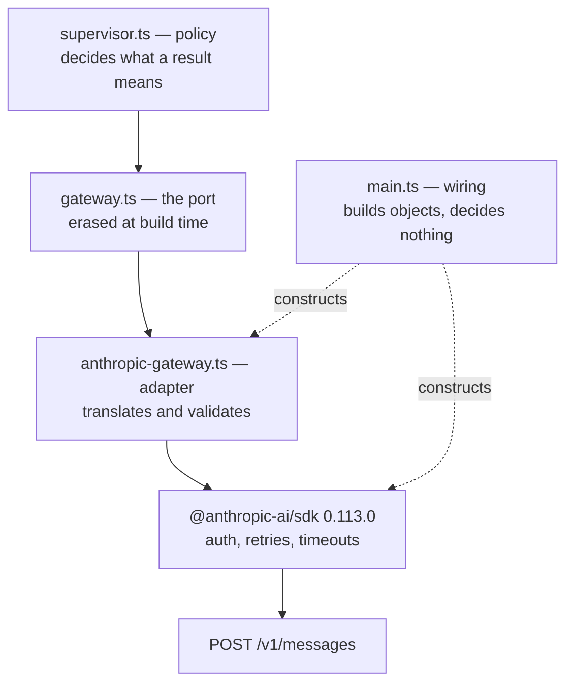
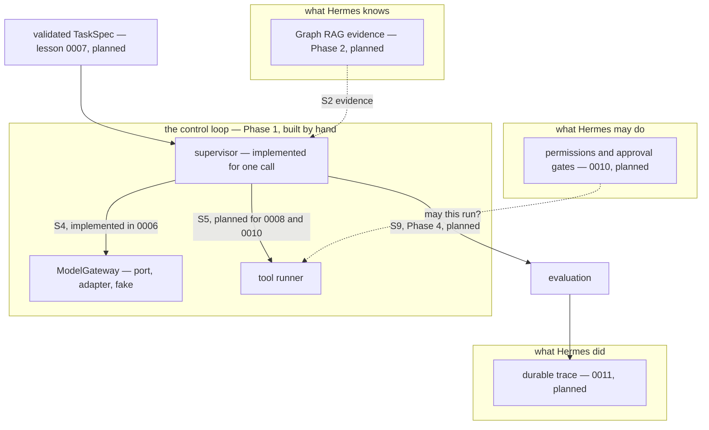

# Lesson 0006a. What Counts as Policy

Supplement to [[lesson-0006-the-model-gateway]]. It defines one word and labels what exercise 05
contains. It ships no code.

**Main question.** Lesson 0006 put Hermes policy above the port and the SDK below it. Which of the things
in exercise 05 is actually policy?

## Terms

| Term | Status | Note |
|---|---|---|
| [[hermes-policy]] | introduced | The definition the supplement is built on |
| [[composition-root]] | introduced | `main.ts`, the file that builds the objects |
| [[routing-policy]] | introduced | Named so it can be marked absent |

Reprised from lesson 0006: [[port]], [[adapter]], [[fake]], [[dependency-inversion]],
[[model-gateway]], [[test-double]].

```dataview
TABLE status, category, introduced
FROM "wiki/terms"
WHERE lesson = "0006a"
SORT term ASC
```

## Diagram 1. The call direction



Imports point at the port from both sides, so this is not the import graph. Wiring stands beside the
path and takes no part in a call.

## Diagram 2. One job crossing the intended system

Cut from the supplement in the 2026-08-08 rewrite. It is context, and [[lesson-0006b-the-hermes-control-plane]]
now owns the wider system. Kept here so it is not lost.



Three structures stay separate on purpose. What Hermes knows, what it may do, and what it did are
kept apart, because [[drift]] is the disagreement between intent and reality. A merged structure would
let one side win silently.

## What the rewrite removed

The 2026-08-08 rewrite cut this supplement from 4,088 words to 1,320, under `CLAUDE.md` Article VIII.
Removed material and its new home:

| Cut | Why | Where it went |
|---|---|---|
| The nine moments of one job | Context, not this supplement's question | Diagram 2 above, and [[lesson-0006b-the-hermes-control-plane]] |
| The layer stack, file by file | Reprise of lesson 0006 §2 and §3 | [[lesson-0006-the-model-gateway]] |
| Two step-by-step call walkthroughs | Reprise of measurements already in lesson 0006 | Deleted |
| The ownership matrix | Restates the five-category table | Deleted |
| Why provider-neutral types are worth it | Argues for the port, so it belongs with the port | [[lesson-0006-the-model-gateway]] |
| The concern-by-concern status table | Merged | The single status table in §3 |
| Four opening callouts, about 380 words | Article VIII.4: teaching starts within 100 words | Footer, compressed |

## Related

- [[lesson-0006-the-model-gateway]]. The lesson this supplements.
- [[lesson-0006b-the-hermes-control-plane]]. The wider system.
- `docs/style/ste-profile.md`. The rules the rewrite followed.
