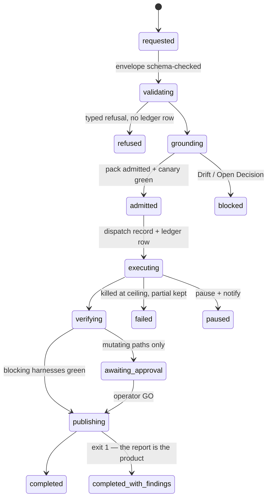
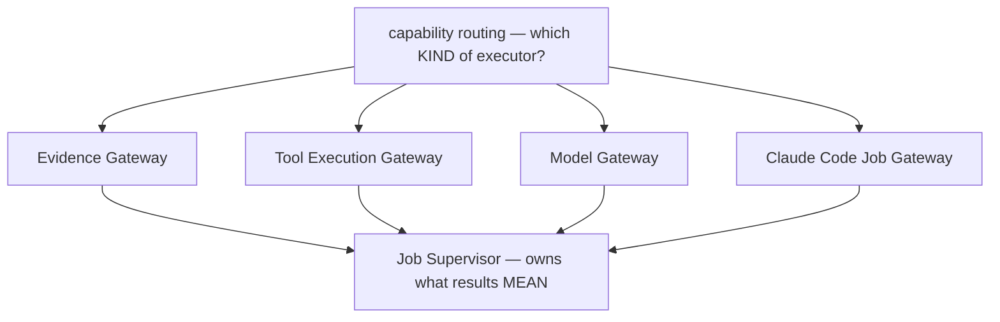

# Supplement 0006b — The Hermes Control Plane: From Job to Evidence

The second supplement to lesson 0006, and the architectural prior to both: where 0006a mapped the *course's* system from the code seam outward, 0006b maps the **decided Hermes OS** from the job inward — grounded in the governance record (PDR-001, ADR-0001..0021, the Wave-1 issue records), with every claim labeled **accepted · scaffolded · planned · proposed clarification · open decision · illustrative only**. No TypeScript anywhere in it, deliberately. Material: [open the supplement](../../lessons/0006b-the-hermes-control-plane.html) · durable reference: `docs/hermes_os/architecture/hermes-job-control-plane.md` (mirror; canonical in the `hermes-os` repo) · defect record: [[course-pedagogy]] row 13.

**Reading order:** lesson 0006 §1 → **0006b** → 0006a's policy/mechanics classification → the rest of 0006 and exercise 05.

## The spine of it: one job, twelve moments

The v1 vertical slice `hermes rag audit atlas --graph-health --cost-report --no-writeback` walked from operator request to Artifact Vault: request → envelope validation → grounding (pack) → admission (three fail-closed rules) → static decomposition → **deterministic evidence first** → the capability question → the first genuine model step (planned — the real Wave-1 skeleton reached review with **zero model calls**) → verification (blocking map) → no approval needed (nothing mutated) → terminal → record. Eleven of twelve moments are deterministic.



State **names are a proposed clarification** (ADR-0018 fixes only *where* state lives — an enumerated state model is a recommended Open Decision); every **transition is an accepted fact** (typed refusal without ledger row, kill-at-ceiling → failed, pause + notify, exit codes 0/1/2).

## The placement rule (what the supplement exists to plant)

> The Model Gateway is introduced when an admitted Hermes job reaches a permitted step that requires probabilistic model reasoning and cannot be completed by authoritative retrieval or deterministic tools alone.

The course built the gateway first (lesson 0006) for SDK pedagogy — a *teaching* order, not the Hermes OS *implementation* order. Compression: *Policy constrains. Router selects. Gateway executes. Supervisor decides. Harness verifies. Human approves. Trace records.*



## Hermes anchoring

Touches all of **S1–S9** by walking the scenario's own job. Open decisions surfaced (recorded, not resolved): the manifest-vs-envelope naming split (ADR-0001 vs 0006/0007/0012), the course's TaskSpec ↔ governance mapping, and the missing canonical job state model — all filed in the governance repo's `docs/open-decisions.md`.

## Terms introduced

[[hermes-job]] · [[job-envelope]] · [[context-pack]] · [[job-supervisor]] · [[capability-routing]] · [[capability-gateway]] · [[spec-to-evidence-loop]] · [[drift]] · [[artifact-vault]]

```dataview
TABLE term AS Term, category AS Category, status AS Status
FROM "wiki/terms"
WHERE type = "glossary-term" AND lesson = "0006b"
SORT category ASC, term ASC
```
