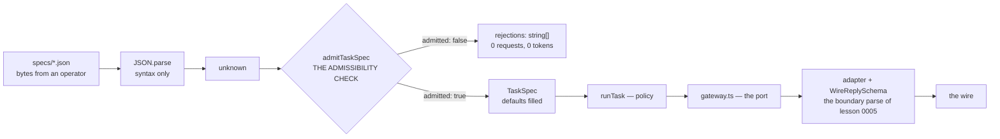
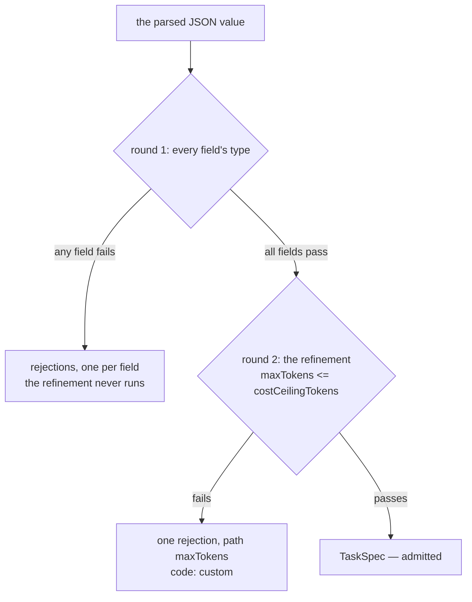

# Lesson 0007 — The TaskSpec Is a Contract

Phase 1's second lesson parses the job itself. A [[task-spec|TaskSpec]] is a [[zod-schema]] for one unit of work, and the [[admissibility-check]] decides whether that work may run. Lesson 0005 aimed [[safe-parse]] at a provider's reply. This lesson aims the same call at an operator's file, so the [[json-boundary]] rule now covers both directions into the loop.

The port and both gateways arrive from lesson 0006 unchanged. The spec sits above the port, and the adapter never learns that one exists.

Material: [open the lesson](../../lessons/0007-the-taskspec-is-a-contract.html) · lab: `hermes-sdk-lab/06-taskspec/`.

## Two boundaries, two parses, one loop



## The two rounds of a parse



Measured against zod 4.4.3 and SDK 0.113.0:

- The valid file carries 5 keys and the admitted spec has 7, with `maxTokens: 1024` and `allowedTools: []` filled in.
- The job landed at 65 tokens, and the wire's `max_tokens` came from the spec rather than a literal.
- One bad file produced 3 rejections from a single parse, and a JSON array produced one at path `(root)`.
- The fake recorded 0 calls across Part B, and the mock's request id moved from `req_mock_0001` to `req_mock_0002`.
- The ceiling file was refused by the [[schema-refinement|refinement]] at path `maxTokens`, with code `custom`.
- A file that omits `owner` and also breaks the ceiling rule reports the `owner` issue alone.

## Hermes anchoring

Scenario step **S1**: the job is parsed before anything else happens, and invalid work is rejected before a token is spent. The course's TaskSpec is the smaller relative of the [[job-envelope]], whose eight fields the governance record defines. Two of this lesson's fields are carried but not yet enforced. `costCeilingTokens` waits for lesson 0009, and `allowedTools` waits for lesson 0010.

## Terms introduced

[[task-spec]] · [[admissibility-check]] · [[schema-refinement]]

```dataview
TABLE term AS Term, category AS Category, status AS Status
FROM "wiki/terms"
WHERE type = "glossary-term" AND lesson = "0007"
SORT category ASC, term ASC
```
