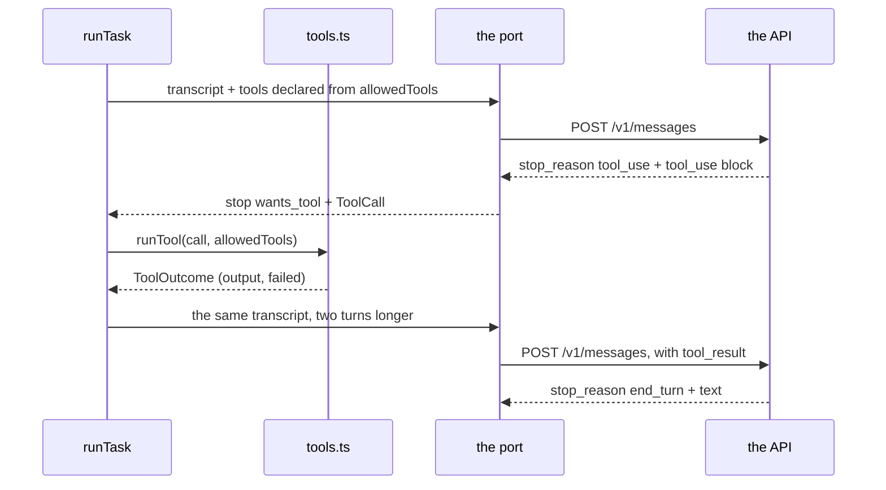
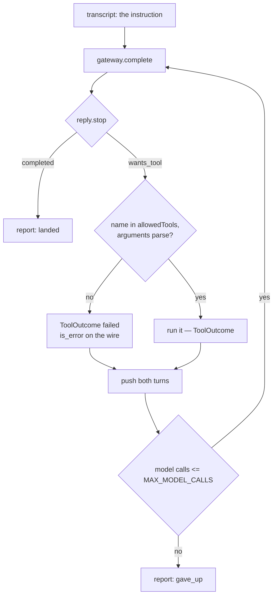

# Lesson 0008 — Tool Use, the Loop's Heartbeat

Phase 1's third lesson turns one model call into a [[tool-loop]]. A reply can now carry a [[tool-use-block|tool_use]] block instead of finishing, and Hermes answers with a [[tool-result-block|tool_result]] block in the next request.

The model runs nothing. It names a tool, and `tools.ts` decides whether to run it. The [[task-spec]]'s `allowedTools` field gets its first reader, two lessons after it was declared.

Material: [open the lesson](../../lessons/0008-tool-use-the-loops-heartbeat.html) · lab: `hermes-sdk-lab/07-tool-loop/`.

## One tool call, answered



## Where the loop can end



Measured against zod 4.4.3 and SDK 0.113.0:

- Part A ran two model calls for one job, spent 217 tokens, and ran `graph_health` once.
- The wire showed `input_tokens` at 23 on request 1 and 110 on request 2, which is the transcript being resent.
- The mock's answer quoted the tool's own output, so the result crossed the wire and came back.
- Part B refused `graph_writeback`, a tool the catalogue holds and the spec never permitted.
- Part B's transcript grew from 1 turn to 3, as `operator` then `operator → model → tools`.
- Part C declared no tools, made one call, and spent 65 tokens, matching exercise 06.

## Hermes anchoring

Scenario step **S5** (the loop iterates) is what this lesson builds. Two of its three parts are here: the model asks, and Hermes runs or refuses. The gate check that queues a call for an operator arrives in lesson 0010. The `graph_health` tool answers from canned data, because the real evidence surface is Phase 2's work over MCP.

## Terms introduced

[[tool-use-block]] · [[tool-result-block]] · [[tool-loop]]

```dataview
TABLE term AS Term, category AS Category, status AS Status
FROM "wiki/terms"
WHERE type = "glossary-term" AND lesson = "0008"
SORT category ASC, term ASC
```
