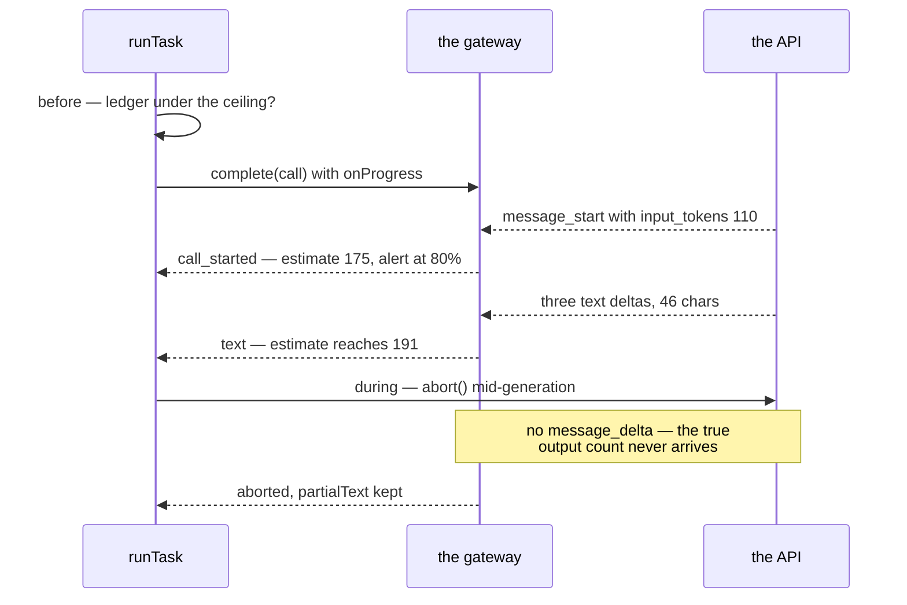
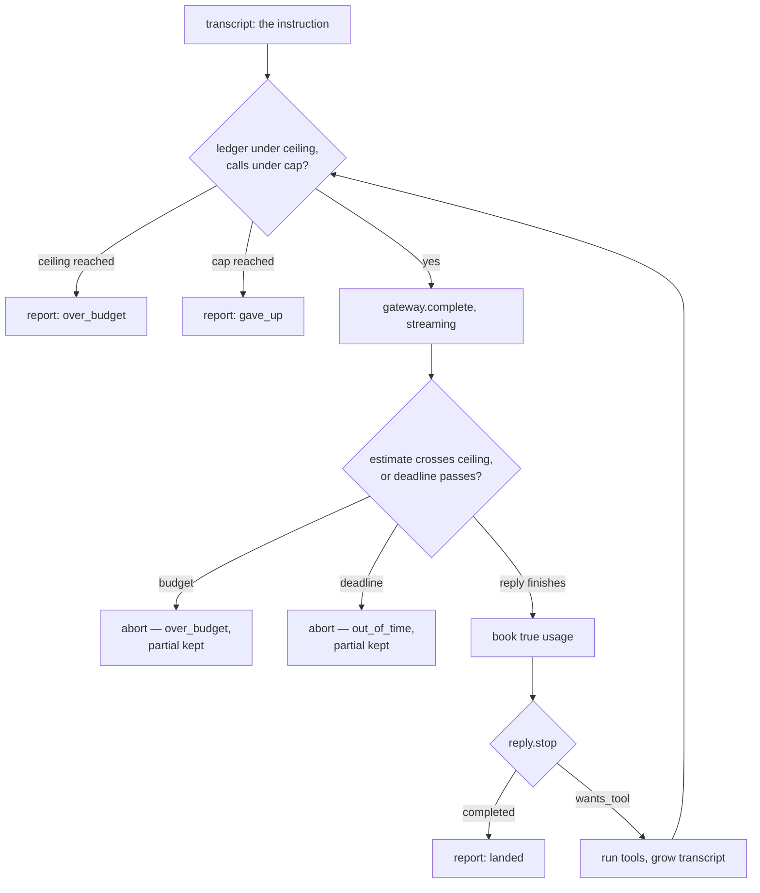

# Lesson 0009 — Bounds and Termination

Phase 1's fourth lesson bounds the [[tool-loop]]. Lesson 0008's literal call cap moves into the [[task-spec]] as `maxModelCalls`, next to the token ceiling and a new `deadlineMs`. The result is [[termination]]: every job ends, and every exit is a classified outcome.

The gateway streams every call now, because a bound checked only after a reply lands cannot stop the reply. When the budget or the deadline fires mid-generation, the stopped reply survives as a [[partial-artifact]].

Material: [open the lesson](../../lessons/0009-bounds-and-termination.html) · lab: `hermes-sdk-lab/07-tool-loop/` Parts D to F.

## One bounded call



## Every exit is classified



Measured against zod 4.4.3 and SDK 0.113.0:

- Parts A to C still report 217, 95 and 65 tokens through the new streaming delivery.
- Part D's fake was scripted for three tool-hungry replies and answered two, because the spec said `maxModelCalls: 2`.
- Part E aborted call 2 after 46 of 82 characters and booked 191 estimated tokens against a ceiling of 190.
- Part F's 2400 ms deadline ended the job at about 2424 ms, keeping 24 characters.
- The wire reported `input_tokens: 110` in `message_start` and the true `output_tokens: 42` only in `message_delta`.
- An aborted call never receives `message_delta`, so its spend stays an estimate, and the report says so.

## Hermes anchoring

Scenario step **S6** (the budget is enforced) is what this lesson builds: the ceiling, the 80% alert, and the mid-generation kill that keeps the partial output. The partial's destination, the Artifact Vault of step S8 (outputs land), does not exist yet, so the report's notes stand in for it. The user predicted this design in the lesson 0004 recall work. An in-stream budget stop must act on a conservative estimate, because true output counts arrive only at the end.

## What the lesson does not claim

The estimate can overshoot by one step, and Part E's 191 against 190 shows it. The mock's own token counts are estimates, and its canned output is 42 tokens. The measured ledgers are exact for this mock and illustrative for a real provider.

## Terms introduced

[[termination]] · [[partial-artifact]]

```dataview
TABLE term AS Term, category AS Category, status AS Status
FROM "wiki/terms"
WHERE type = "glossary-term" AND lesson = "0009"
SORT category ASC, term ASC
```
