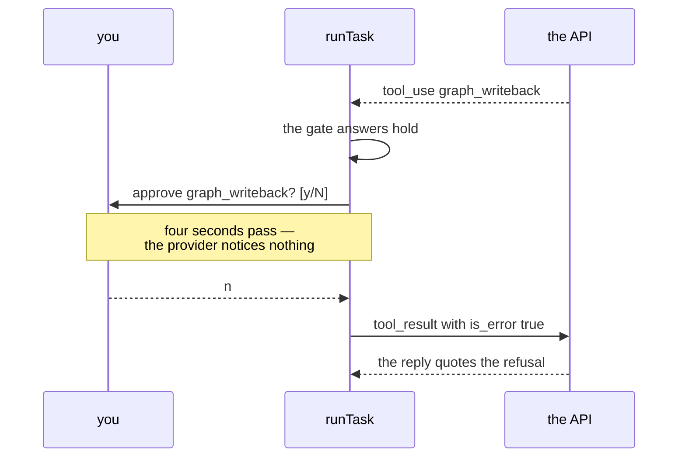
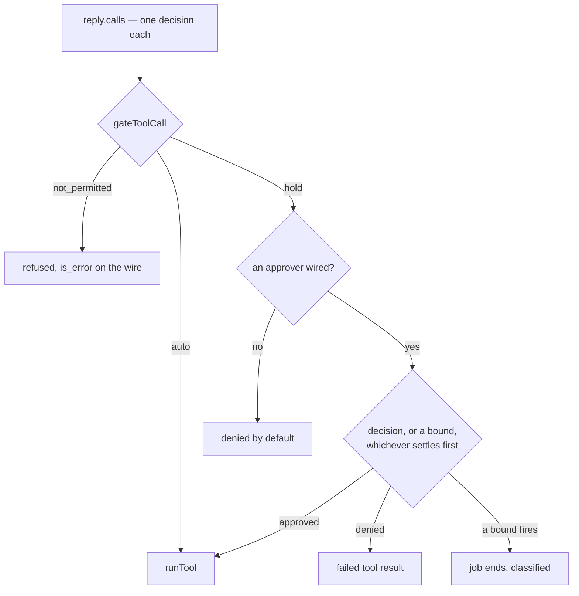

# Lesson 0010 — Approval Gates and Permissions

Phase 1's fifth lesson puts an [[approval-gate]] between a `tool_use` and its run. Permission gains a third level: a tool can be unlisted, permitted, or permitted with approval, and all three levels live in the [[task-spec]]. One pure function in `approval.ts` reads the spec and answers `not_permitted`, `auto` or `hold`.

A held call goes to the `ApprovalPort`. The wiring decides who answers: a script in Part G, your terminal in Part H, nobody in Part I. With no channel wired, [[default-deny]] applies. The wait shares the job's `AbortController`, so [[termination]] survives a silent operator.

Material: [open the lesson](../../lessons/0010-approval-gates-and-permissions.html) · lab: `hermes-sdk-lab/07-tool-loop/` Parts G to I.

## One denied call



## Every call gets a decision



Measured against zod 4.4.3 and SDK 0.113.0:

- Part G's one reply carried two calls and got two decisions: `graph_health → ran`, `graph_writeback → denied by the operator`, 136 tokens, landed.
- Part H, approved: `ran (approved)`, the answer quotes `wrote patch to atlas`, 221 tokens.
- Part H, denied: the denial crossed the wire as a `tool_result` with `is_error: true`, 229 tokens.
- The two second requests are identical except that one block, and no request field records the gate.
- Part I's operator never answers, and the 2000 ms deadline ended the job at about 2018 ms, `out_of_time`.
- Parts A to F still produce their lesson 0008 and 0009 numbers, re-run as regression.

## Hermes anchoring

Scenario step S5 (the loop iterates) gains its gate check in this lesson: read-only queries pass automatically, and the writeback tool waits for the operator. The gate's decisions live in the report's `toolRuns`, which dies with the process. Lesson 0011 makes the record durable, and Phase 3 lifts the gates onto the workflow graph's edges.

## What the lesson does not claim

No queue of pending approvals exists: a held call blocks its own job in place. The mock invents the patch argument from the tool's schema, so it reads `"atlas"`. The mock's final answer quotes whatever the `tool_result` carried, a denial included.

## Terms introduced

[[approval-gate]] · [[default-deny]]

```dataview
TABLE term AS Term, category AS Category, status AS Status
FROM "wiki/terms"
WHERE type = "glossary-term" AND lesson = "0010"
SORT category ASC, term ASC
```
