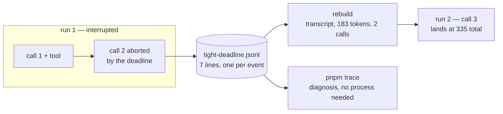

# Lesson 0011 — The Trace Is What Happened

Phase 1's sixth lesson gives every run a [[trace]]: one event appended per supervisor decision, at the moment it happens. The file is [[json-lines|JSON Lines]], so an append never rewrites earlier lines and the line number is the sequence number. The supervisor writes through a third [[port]], beside the model's and the operator's.

A trace file read back is a JSON boundary like the other three. The reader runs [[safe-parse|safeParse]] per line and refuses what fails, one line at a time. A resumed job is rebuilt from the file alone: transcript, ledger and call count carry, and the clock restarts.

Material: [open the lesson](../../lessons/0011-the-trace-is-what-happened.html) · lab: `hermes-sdk-lab/07-tool-loop/` Parts J to L.

## One file, two readers



Measured against zod 4.4.3 and SDK 0.113.0, fresh mock per capture:

- Part J wires a trace onto Part A's job, and the report is unchanged at 217 tokens beside a file of 8 events.
- The only value on both sides of the wire is the request id, a response header stored per `reply` event.
- Part K diagnoses the tight-budget run from the file alone, and a tampered ledger field is refused as `invalid_type`.
- One refused line costs that line, the other six still read, and the missing `job_ended` is flagged.
- Part L resumes the tight-deadline run: ledger 183 → 335 across two runs, the resumed call is call 3, the deadline restarts.
- Parts A to I re-ran as regression and reproduce their lesson 0008 to 0010 numbers.

## Hermes anchoring

Scenario step S7 (the durable trace) lands in this lesson. The record answers what happened, kept apart from what Hermes knows and what it may do. The trace decides nothing: deleting it changes no future run, and editing it cannot approve a tool. Outputs landing in an Artifact Vault stay planned, per ROADMAP Phases 1 and 4.

## What the lesson does not claim

The sync append survives a process death, not a power cut. Machine-level durability needs fsync, which the lab skips. The aborted call's true output count exists only in the provider's logs, because `message_delta` never arrived.

## Terms introduced

[[trace]] · [[json-lines]]

```dataview
TABLE term AS Term, category AS Category, status AS Status
FROM "wiki/terms"
WHERE type = "glossary-term" AND lesson = "0011"
SORT category ASC, term ASC
```
