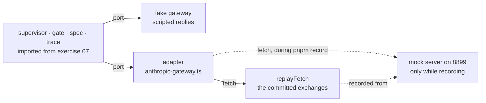

# Lesson 0012 — Offline by Construction

Phase 1's capstone proves the whole loop with no model, no key, and nothing listening on any port. An offline test proves only what its stand-in preserves. The [[fake]] preserves the [[port]], so it proves policy. A [[fixture]] preserves the bytes, so it proves the [[adapter]]'s translations. The mock preserves time, and stays the only place a mid-generation abort can be watched.

The fixtures reach under the SDK through the client's `fetch` option: one injected function serves recorded responses and captures what the SDK sent. Reading a fixture back is a parse, the course's fifth JSON boundary. The recorder lives in the repo, so fixtures can be remade and drift becomes a diff.

Material: [open the lesson](../../lessons/0012-offline-by-construction.html) · lab: `hermes-sdk-lab/08-tested-adapters/`.

## Two stand-ins at two depths



Measured against SDK 0.113.0, zod 4.4.3 and vitest 3.2.7, on 2026-09-01:

- 29 tests across 6 files, all green with no process listening, in about 12 seconds.
- The capstone replays exercise 07 Part A's job and lands at its live numbers: 2 calls, one tool run, 217 tokens, 8 trace events.
- The regenerated second request matches the recorded bytes, and a dropped model turn fails 3 tests across 2 suites.
- A fixture number tampered into a string is refused by the adapter's boundary parse, not by a test.
- The recorded 429 classifies as throttled with `retryAfterMs: 5000`, under `maxRetries: 0`.
- Re-recording against a fresh mock reproduces every fixture, with only `recordedAt` changing.

## Hermes anchoring

The lesson builds toward scenario step S9 (scoring the run), which needs runs that repeat on demand. Phase 1's exit criterion is met: a bounded loop with permissions, budgets, approval and termination, testable offline with fakes and recorded fixtures.

## What the lesson does not claim

Timing stays unproven offline: the fake answers instantly and a replayed stream arrives whole. The real provider stays unproven: fixtures freeze the mock, whose error wording is an approximation. The operator stays unproven: the approval port is scripted, so the port is tested and the human is not.

## Terms introduced

[[fixture]]

```dataview
TABLE term AS Term, category AS Category, status AS Status
FROM "wiki/terms"
WHERE type = "glossary-term" AND lesson = "0012"
SORT category ASC, term ASC
```
