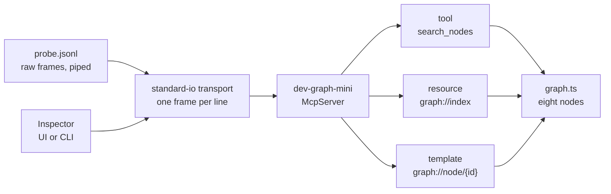
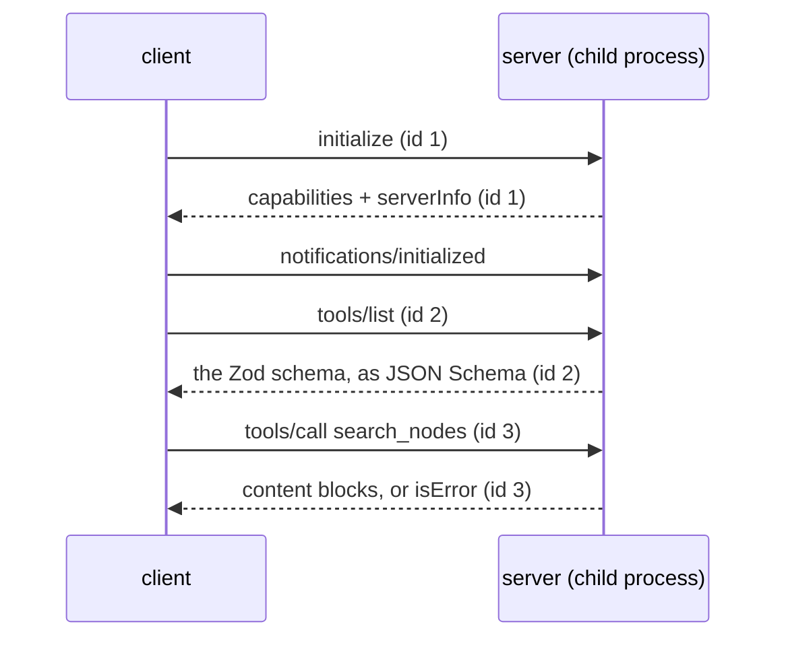

# Lesson 0013 — MCP Anatomy

Phase 2 opens with the tool leaving the process. [[mcp|MCP]] lets a server host a tool, describe it over the wire, and run it on request. A client discovers the schema at runtime with `tools/list`, so it travels instead of being compiled in. A [[resource]] answers a client's read at a URI, and no model turn is spent. The standard-io [[transport]] carries one [[json-rpc|JSON-RPC]] frame per line, between a client and the child process it owns.

Exercise 09 serves a miniature knowledge graph: one tool, one static resource, one template, eight nodes. The snapshot stands in for the real `dev_graph`, which stays Python-side.

Material: [open the lesson](../../lessons/0013-mcp-anatomy.html) · lab: `hermes-sdk-lab/09-mcp-server/`.

## The anatomy



## The handshake



Measured against `@modelcontextprotocol/server` 2.0.0, zod 4.4.3 and Inspector 2.4.0, on 2026-09-02:

- The piped probe's seven frames drew six answers, out of order: ids 1, 2, 5, 6, 4, 3.
- The `tools/list` reply carries the Zod schema as JSON Schema, with `minLength` and the `required` list intact.
- Calling with `query: 42` fails in-band with `isError: true`, before the handler runs.
- Reading `graph://node/nope` fails as a protocol error, code `-32603`.
- A stray `console.log` line lands between frames, and Inspector 2.4.0 skips it.
- A widened `.max(20)` changes what every client sees on the next list.

## Hermes anchoring

The lesson builds toward scenario step S2 (evidence assembled), where Hermes fills a Context Pack by querying the knowledge graph through typed tools. The surface exists and answers with no model anywhere. Provenance arrives in lesson 0014, the scripted client in 0015, and the loop consumes evidence in 0016.

## What the lesson does not claim

No model chose a tool here: the clients were you and the Inspector. The eight-node graph is a stand-in, and the real `dev_graph` joins through a typed port later in Phase 2. Evidence items carry no provenance yet.

## Terms introduced

[[mcp]] · [[resource]] · [[transport]] · [[json-rpc]]

```dataview
TABLE term AS Term, category AS Category, status AS Status
FROM "wiki/terms"
WHERE type = "glossary-term" AND lesson = "0013"
SORT category ASC, term ASC
```
