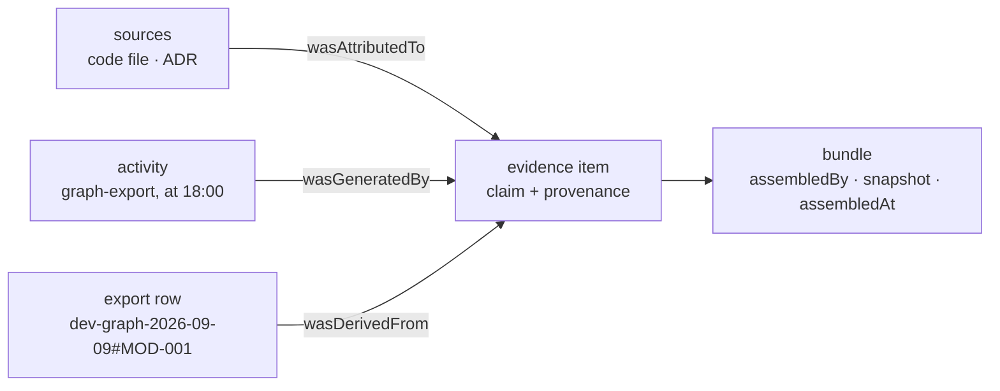
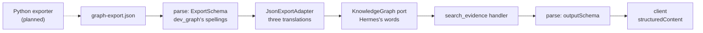

# Lesson 0014 — Evidence With Provenance

Lesson 0013's server answered with a title and a status. This lesson decides what an answer must carry before Hermes may believe it. The answer is [[provenance]]: who stands behind a claim, which activity produced it, and what it was made from. W3C PROV-DM names those relations, and the schema keeps each as one field. One claim packaged with its provenance is an [[evidence-item|evidence item]], and a bundle of items carries provenance of its own. The label from dev_graph's closed list is [[confidence]], never a number, and its first promotion rule is a refinement.

Exercise 10 adds a `KnowledgeGraph` [[port]] and one [[adapter]] over a JSON file the Python side wrote. The MCP tool gains an `outputSchema`, so the answer's shape travels and the SDK parses `structuredContent` after the handler.

Material: [open the lesson](../../lessons/0014-evidence-with-provenance.html) · lab: `hermes-sdk-lab/10-graph-evidence/`.

## PROV-DM as three fields



## Two parses guard one answer



Measured against `@modelcontextprotocol/server` 2.0.0, zod 4.4.3 and vitest 3.2.7, on 2026-09-10:

- The suite holds 18 tests, all green, and the whole workspace typechecks.
- The piped probe's seven frames drew six answers, out of order: ids 1, 2, 5, 6, 3, 4.
- The `tools/list` reply carries the output schema with the seven source kinds and `minItems: 1`, and no two-sources refinement.
- A handler that drops `assembledBy` fails in-band with `isError: true` and an output validation message.
- An export row marked `confirmed` with one source stops the server at wiring.
- A miss returns an empty bundle with no error, and an unknown URI fails as a protocol error, code `-32603`.

## Hermes anchoring

The lesson builds toward scenario step S2 (evidence assembled), where every Context Pack item carries provenance. The boundary rule gains a sixth surface, a file that another language wrote. Provenance describes what Hermes knows, and the trace of lesson 0011 still records what it did, in a separate file. Confidence labels and the promotion table are dev_graph practice, quoted from its `CLAUDE.md`, and are not part of PROV-DM.

## What the lesson does not claim

The export file is a hand-written stand-in. No Python process runs, and the exporter is planned. No fake adapter and no recorded fixtures exist yet, and no scripted client parses the bundle on its own side. Those arrive in lesson 0015. The loop does not consume a bundle until lesson 0016.

## Terms introduced

[[provenance]] · [[evidence-item]] · [[derivation]] · [[confidence]]

```dataview
TABLE term AS Term, category AS Category, status AS Status
FROM "wiki/terms"
WHERE type = "glossary-term" AND lesson = "0014"
SORT category ASC, term ASC
```
