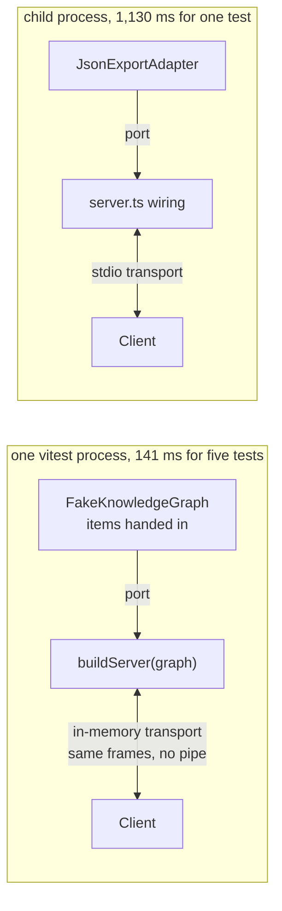
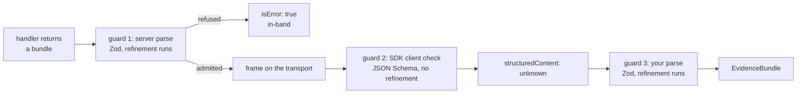

# Lesson 0015 — Test It Without an LLM

Lesson 0014's server answers with provenance. This lesson proves the whole surface with no model in the room. An [[mcp-client|MCP client]] is a program that connects over a [[transport]] and calls what the server serves, and its data channel arrives typed `unknown`. An [[in-memory-transport|in-memory transport]] joins a real client and a real server in one process, so a suite needs no pipe. The server became a function of its [[port]], so a [[fake]] can stand behind it. A recorded bundle is a [[fixture]]: parsed on the way in, replayed through the real tool.

Material: [open the lesson](../../lessons/0015-test-it-without-an-llm.html) · lab: `hermes-sdk-lab/10-graph-evidence/`.

## Two ways to put a real client on a real server



## Three guards on one answer



Measured against `@modelcontextprotocol/client` 2.0.0, `@modelcontextprotocol/server` 2.0.0, zod 4.4.3 and vitest 3.2.7 on Node 22.14.0, on 2026-09-20:

- The suite holds 32 tests in six files, all green, and the whole workspace typechecks.
- Five in-memory tests take 141 ms together, against 1,130 ms for the one stdio test.
- A fake item marked `confirmed` with one source is refused in-band by the server's output parse, with the two-sources message.
- The SDK client checks `structuredContent` against the advertised JSON Schema inside `callTool`, and that check carries no refinement.
- A fixture with a source kind of `blog` is refused at `result.items[0].provenance.sources[0].kind`, and a hand-promoted `confirmed` is refused with the two-sources message.
- A replay returns the recorded items unchanged, and only `assembledBy.adapter` differs.

## Hermes anchoring

The lesson builds toward scenario step S2 (evidence assembled), where a program inside the loop calls this surface. It also serves step S9 (scoring the run), which grows from suites that run this fast. Phase 2's exit rule, testable without an LLM, holds before the loop consumes anything. What the graph knows still stays apart from what the loop did. The fake records queries for a test, and the trace of lesson 0011 is a separate file.

## What the lesson does not claim

No loop consumes a bundle yet. That is lesson 0016. The export is still a hand-written stand-in, and no Python process runs. Timings are from one machine and one run each.

## Terms introduced

[[mcp-client]] · [[in-memory-transport]]

```dataview
TABLE term AS Term, category AS Category, status AS Status
FROM "wiki/terms"
WHERE type = "glossary-term" AND lesson = "0015"
SORT category ASC, term ASC
```
