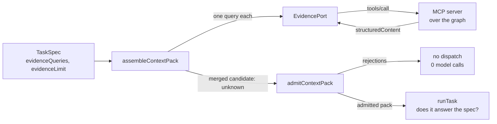
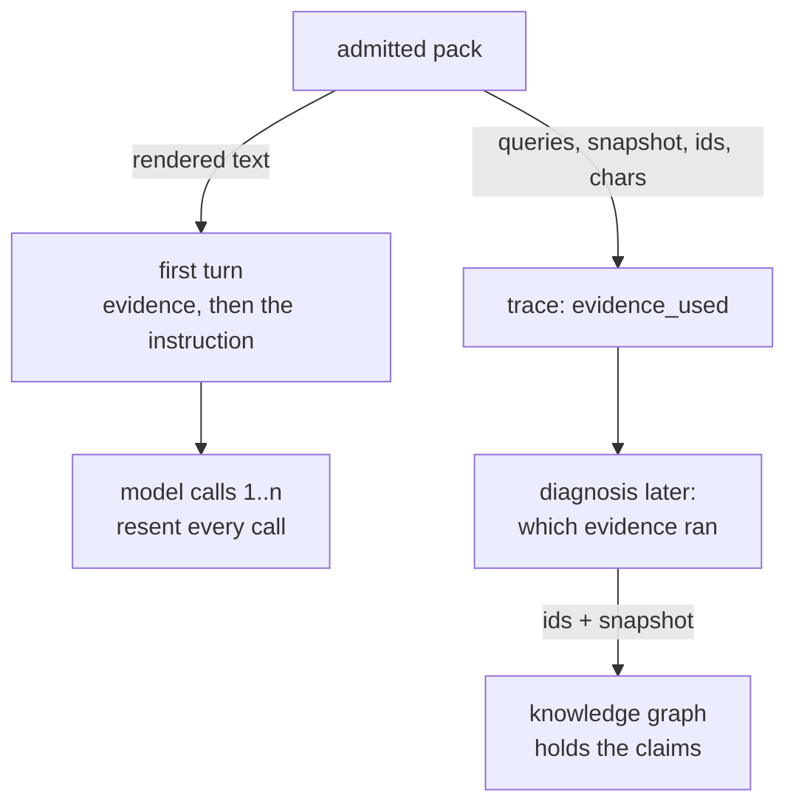

# Lesson 0016 — Evidence Enters the Loop

The evidence surface now feeds the Phase 1 loop, through an [[evidence-port|evidence port]]: a query and a limit go in, one bundle comes back. A [[context-pack|Context Pack]] is the merged answers to one job's queries, admitted by a parse before dispatch. Four rules decide admissibility, and the fourth is lesson 0014's [[schema-refinement|refinement]], running because the pack nests the evidence schema. A fifth rule sits in the supervisor, because the schema never sees the spec: the pack must answer the spec's queries and no others. The pack goes into the first turn, so every model call pays for it again. The [[trace]] records which evidence a job used, and the graph keeps the claims.

Material: [open the lesson](../../lessons/0016-evidence-enters-the-loop.html) · lab: `hermes-sdk-lab/11-evidence-in-the-loop/`.

## Assembly gathers, the parse admits



## Two readers, two halves



Measured against `@modelcontextprotocol/client` 2.0.0, `@modelcontextprotocol/server` 2.0.0, `@anthropic-ai/sdk` 0.113.0, zod 4.4.3 and vitest 3.2.7 on Node 22.14.0, on 2026-09-30:

- Two queries return one item each from snapshot `dev-graph-2026-09-09`, and the pack renders to 509 characters.
- The grounded job spends 494 tokens across two calls, and the bare job spends 236.
- Input tokens per call are 162 then 248, against 33 then 119, so the pack costs 129 on every call.
- The grounded request body is 1,005 bytes, and `messages[0]` is one `user` message holding the pack and then the instruction.
- Three faults end at `no_evidence` with 0 model calls: no pack arrived, the pack answered other questions, or the spec asked for none.
- Each rule refuses with its own path, including `items.0.provenance.confidence` for `confirmed` on one source.

The suite holds 21 tests in three files. Exercise 08's 29 tests and exercise 10's 32 were re-run green, and all eleven packages typecheck.

## Hermes anchoring

The lesson builds scenario step S2 (evidence assembled), which closes Phase 2. Step S1 (envelope parsed) admits the job and S2 admits its evidence, through the same [[safe-parse]] and the same answer shape. The rule of record is *no pack, no dispatch*, accepted as ADR-0002/0020 in `docs/hermes_os/architecture/hermes-job-control-plane.md`. The two records stay apart: the knowledge graph holds the claims, and the [[trace]] holds one line naming the ids and the snapshot.

## What the lesson does not claim

The record names nine admissibility checks and an eight-step assembly protocol. The lab has four rules and one query step, and says so in its status table. Memory as an advisory block and CodeGraph as a derived section are in the record and not here. The export is still a hand-written stand-in, and no Python process runs. Token counts come from the mock, which estimates one token per four characters of the serialized messages.

A resumed job re-assembles its pack, and nothing yet compares the two `evidence_used` events when the snapshot moves. The supervisor's fifth rule compares query lists in order, so a reordered `evidenceQueries` refuses a pack holding the same items. That strictness is deliberate and untested against a real operator.

## Terms introduced

[[evidence-port]] · [[context-pack]] carried forward from supplement 0006b

```dataview
TABLE term AS Term, category AS Category, status AS Status
FROM "wiki/terms"
WHERE type = "glossary-term" AND lesson = "0016"
SORT category ASC, term ASC
```
