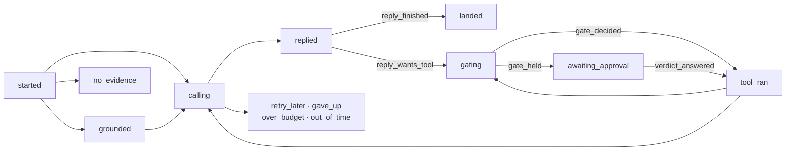
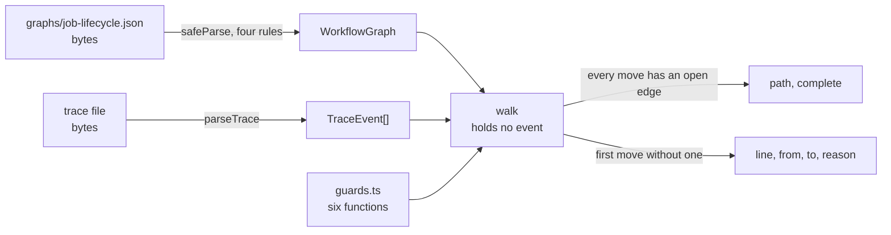

# Lesson 0017 — Thinking in State Graphs

The loop's control flow is written down as data. A [[workflow-graph|workflow graph]] is the states a job may be in and the moves it may make, held as a file of names. Each [[trace]] event enters one node, and an edge is a pair of events the supervisor can write back to back. A [[guard]] is a named rule on an edge.

The file is admitted by a parse with four rules, and a strict shape refuses a `claims` key or an `events` key at the root. A walker replays a trace along the graph with zero model calls, holds no event, and refuses with a line number. Six recorded runs are legal paths.

Material: [open the lesson](../../lessons/0017-thinking-in-state-graphs.html) · lab: `hermes-sdk-lab/12-workflow-graph/`.

## The job lifecycle graph



## Two parses feed the walker



Measured against zod 4.4.3 and vitest 3.2.7 on Node 22.14.0, on 2026-10-06:

- The graph holds 13 nodes, 26 edges and 6 guard names, read from `supervisor.ts`.
- Six recordings from labs 07 and 11 are legal and complete, and together take 10 of the 26 edges.
- The tests walk four more edges through the real supervisor against a fake gateway, with 0 model calls.
- The grounded recording with its evidence line moved after call 1 is refused at line 3 with `no edge calling > grounded`.
- A `claims` key or an `events` key is refused at the root with `unrecognized_keys`.
- Each of the four rules refuses with its own path and message.

The suite holds 32 tests in three files. Two rules were proved necessary by breaking them and watching tests fail. Exercise 08's 29 tests and exercise 11's 21 were re-run green, and all twelve packages typecheck.

## Hermes anchoring

The lesson opens Phase 3 and builds scenario step S3 (dispatch under the graph). The graph is the second of the three records, kept apart from the knowledge graph and the [[trace]] by a strict parse. Hermes's own job state set is a proposed clarification in `hermes-job-control-plane.md` §4, and the lab's node names come from the supervisor, not from that proposal. One accepted fact the graph already holds: a refusal before dispatch is a typed outcome with no model call, which is `no_evidence` at 0 calls.

## What the lesson does not claim

Nothing reads the graph to drive the supervisor. The `if` statements still run the loop, and the graph describes them after the fact. A graph that drifts from the code is caught only when a recording takes an edge the graph lacks. Twelve of the 26 edges are drawn and unwalked. The `awaiting_approval` node is the moment the operator answers, not a parked state a second process can answer. Both are lessons 0018 and 0019.

## Terms introduced

[[workflow-graph]] · [[guard]] · [[terminal-node]]

```dataview
TABLE term AS Term, category AS Category, status AS Status
FROM "wiki/terms"
WHERE type = "glossary-term" AND lesson = "0017"
SORT category ASC, term ASC
```
