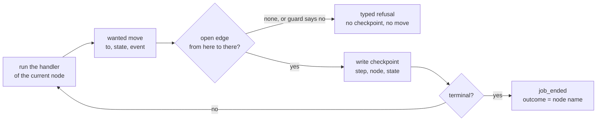
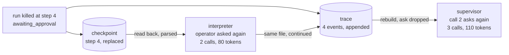

# Lesson 0018 — The Loop Walks the Graph

The graph of lesson 0017 decides the next move. Each node's work is a [[node-handler|node handler]] that names the node it wants. The [[graph-interpreter|graph interpreter]] asks the [[workflow-graph|workflow graph]] whether that move exists before making it. A move the graph does not hold is a typed refusal. A [[checkpoint]] holding the state and the next node is written after every step, and a job killed mid-run resumes from it.

Material: [open the lesson](../../lessons/0018-the-loop-walks-the-graph.html) · lab: `hermes-sdk-lab/12-workflow-graph/`, parts D to F.

## One step of the interpreter



## One kill, two records, two resumes



Measured against zod 4.4.3 and vitest 3.2.7 on Node 22.14.0, on 2026-10-07:

- Nine scenarios through lab 07's supervisor and through the handlers return the same report and the same events, and every trace walks legal and complete.
- The supervisor has 2 loops, 3 `continue` statements and 15 early returns, and the handlers have none: 23 returns name a node.
- With the edge `tool_ran > calling` removed, the audit job is refused at step 5 after 1 of 2 scripted model calls.
- Killed while a held call waits, the trace resume lands at 3 model calls and 110 tokens, and the checkpoint resume at 2 calls and 80 tokens.
- Killed inside call 2, the trace resume continues at call 3, the checkpoint resume makes call 2 again, and the walker refuses the combined trace at line 7.
- With the edge check skipped, 4 tests fail, and with the checkpoint save removed, 7 fail.

The suite holds 57 tests in six files. Exercise 08's 29 and exercise 11's 21 were re-run green, and all twelve packages typecheck.

## Hermes anchoring

Scenario step S3 (dispatch under the graph): a job makes only the moves its graph holds. S7 (the run is recorded) gains a second record, the checkpoint, which holds where the run is while the [[trace]] holds what it did. The graph still holds no claims and no events, and the checkpoint refuses an `events` key at the root. Hermes's own job state set is a proposed clarification in `hermes-job-control-plane.md` §4, as in lesson 0017.

## What the lesson does not claim

Lab 07's supervisor is unchanged and still runs labs 08 and 11. The trace vocabulary is unchanged, so a resumed run has no event of its own and continues the same file. One moved line changed: the wait for the operator rejects when the approver throws, which is how the lab kills a run. The node `awaiting_approval` is still answered in-process, and a resumed run asks the operator again. Parking it for a second process is lesson 0019. A tool with side effects re-runs after a resume from the checkpoint before it, which the lab's read-only tool does not show.

## Terms introduced

[[node-handler]] · [[graph-interpreter]] · [[checkpoint]]

```dataview
TABLE term AS Term, category AS Category, status AS Status
FROM "wiki/terms"
WHERE type = "glossary-term" AND lesson = "0018"
SORT category ASC, term ASC
```
